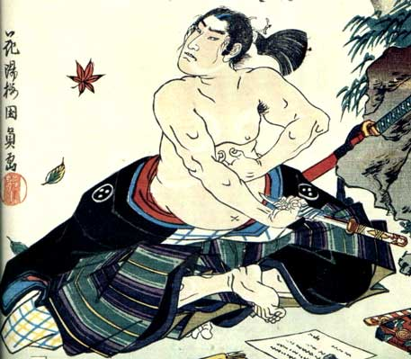

**158/365 Harakiri**, sau seppuku, îşi are rădăcinile în perioada antică a Japoniei şi era rezervat doar samurailor. Acest ritual era folosit pentru corectarea unei greşeli printr-o moarte onorabilă sau când subordonaţii unui conducător care tocmai murise, vroiau să-şi demonstreze loialitatea, dar şi pentru a evita capturarea în caz de război. Actul în sine constă în străpungerea stomacului cu tanto, un tip de sabie japoneză, iar procesul este dus la capăt de o persoană care asistă, prin tăierea capului celui care se sinucide cu o katana. Stomacul era socotit drept sediul tuturor virtuţilor, precum voinţă, curaj, pasiune.
Onoarea valora pentru un japonez mai mult decât propria viaţă, astfel ritualul era privit nu doar o cale mai demnă, ci unica de urmat. Dizgraţia şi înfrângerea erau anulate prin distrugerea fizică.
Ritualul a fost abolit în anul 1868, odată cu declinul samurailor, însă a continuat să fie practicat mai ales în timpul celui de-al Doilea Război Mondial. Unul din cele mai recente şi mai cunoscute cazuri de harakiri, este al scriitorului nominalizat la Premiul Nobel, Yukio Mishima, care s-a sinucis în anul 1970 după ce a condus o lovitură de stat împotriva guvernului japonez, dar care a eşuat.

