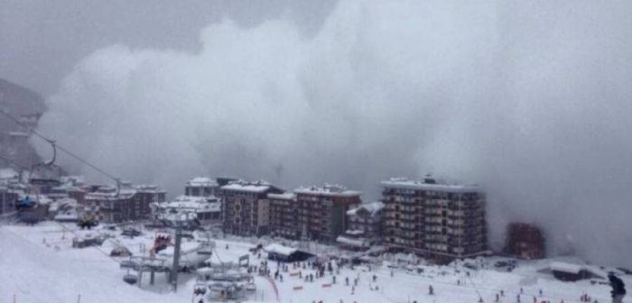

**159/365 Avalanşa** reprezintă deplasarea prin alunecare sau rostogolire a unor cantităţi mari de zăpadă, care pot urni din loc pietre, stânci, arbuşti, etc. Deseori, produc pagube materiale, iar uneori fac şi victime omeneşti. În SUA, în 1910, o avalanşă a târât după sine două trenuri de pasageri. Tot în acelaşi an, în Canada, 62 de muncitori care dezgropau un tren acoperit de o avalanşă, au murit după ce ei la rândul lor au fost acoperiţi de o altă avalanşă. Unele din ele pot fi cauzate de cutremure de pământ, aşa cum s-a întâmplat la 31 mai 1970, în Peru. Cutremurul cu o magnitudine de 7.9 pe scara Mercalli, a cauzat avalanşa care a acoperit un orăşel întreg, făcând peste 18.000 victime. Cu doar opt ani înainte, în 1962, o altă avalanşă în Peru luaseră viaţa a peste 4.000 de persoane, acoperind alte nouă localităţi.
De obicei, în ţările alpine, în locurile favorabile avalanşelor, nu se construiesc clădiri, iar drumurile sau căile ferate se realizează cu tunele. Totuşi, uneori avalanşele pot ajunge în locuri care par a fi sigure, cum s-a întâmplat în Franţa la 20 ianuarie 1981, când avalanşele au distrus peste 100 de locuinţe care erau amplasate acolo de 300-400 de ani. Ţările unde avalanşele sunt frecvente, şi-au creat servicii speciale, iar unul din cele mai vechi, este acel din Elveţia, fondat în 1935. Aceste instituţii dispun de tehnologii speciale cu senzori amplasaţi în sol, care culeg o serie de parametri privind grosimea zăpezii, temperatura, viteza de deplasare a avalanşei, ş.a.

