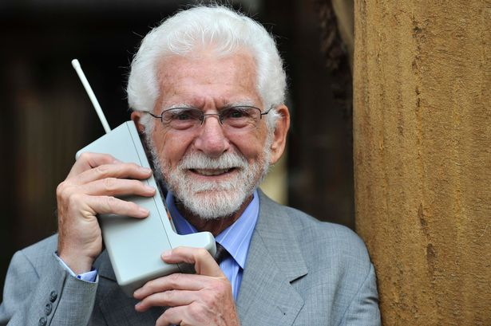

**161/365** Ultimii vreo 15 ani, telefonul mobil a devenit practic accesibil pentru orice muritor de rând, însă istoria acestei tehnologii începe acum mai bine de 100 de ani în urmă, atunci când Lars Magnus Erricson instalează un telefon "fix" conectat la o antenă care, la rândul ei, se conecta la reţeaua de telefonie naţională. Peste mai bine de 35 de ani, inginerul sovietic Zaharcenko testează un telefon mobil pe o rază de 20km, iar primul telefon portabil creat de către aceeaşi sovietici, îşi face apariţia în anul 1957. Opera inginerului Leonid Kuprianovici avea numele de LK-1 şi cântărea aproximativ 3kg, era prevăzut cu o antenă şi un disc pentru formarea discului, iar distanţa maximă de la staţia bază era de până la 30km. Totuşi, primul telefon mobil care era destinat convorbirilor între două persoane care foloseau aparate similare, apare la 3 aprilie 1973, în SUA, când Martin Cooper de la compania Motorola a iniţiat primul apel de pe telefonul mobil, discutând la celălalt capăt cu Joel Engel, de la Bell Labs, companie cunoscută astăzi sub numele de Alcatel-Lucent.La începutul anilor '80, Motorola DynaTAC devine primul telefon mobil comercializat oricărui doritor, care desigur deţinea şi era gata să ofere pentru acesta suma de 3.995$, echivalentul a aproximativ 9.400$ în 2017. Modelul DynaTAC a fost comercializat între anii 1983 şi 1994 şi a suferit o serie de modificaţii în acest timp. Telefonul cântărea cca 1kg, iar acumulatoarele se încărcau în 10 ore. Pe parcusul anilor '90, unul din cei mai importanţi producători mondiali a devenit compania finlandeză Nokia, care a revoluţionat industria prim promovarea terminalelor de generaţia a doua (2G). Primul model Nokia a fost lansat în anul 1992 - Nokia 1011. Tot ei, au fost cei care au lansat primul smartphone - Nokia 9000, iar la începutul anilor 2000 apare telefonu Nokia 3310, care a devenit legendar. Desigur că şi alte companii au participat la dezvoltarea telefonului mobil, astfel că Sony Erricson prezintă telefonul cu touchscreen în 2002, modelul P800, iar doar un an mai devreme lansaseră primul telefon cu ecran color. Dezvoltarea telefoanelor în continuare a avut şi are loc cu o viteză uimitoare. Acestea au ajuns greu de numit doar un simplu telefon, având încorporate în ele camere foto, receptoare GPS, procesoare cu frecvenţa de câţiva GHz, GB de memorie operativă, spaţiu de stocare de zeci şi sute de GB, ecrane touchscreen de diferite mărimi, sisteme de operare şi desigur sute de mii de aplicaţii. Ceea ce încă 20-30 de ani în urmă putea fi văzut doar în filme science-fiction, astăzi, poate fi achizioţionat la preţuri mai mici de 200$ şi folosit chiar şi de copii care abia de pot pronunţa bine cuvintele.

