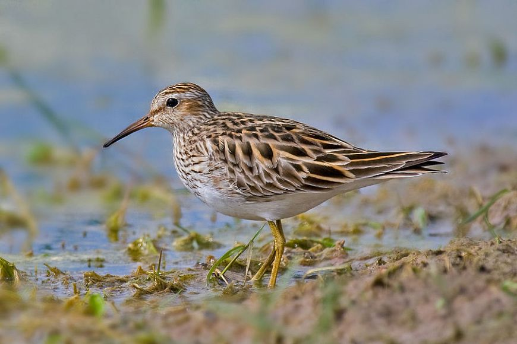

**162/365** Câte zile şi nopţi consecutiv aţi putea rămâne treaz şi în acelaş timp apt de a face ceva? Două? Trei? Poate patru? Totuşi, recordul **fugaciului pătat** puţin probabil că v-ar fi prea uşor să-l doborâţi. Aceste mici păsărici de mărimea unei vrăbii obişnuite, în fiecare an zboară în zona cercului polar pentru a se împerechea. Timp de trei săptămâni, masculii îşi marchează teritoriul şi concurează întrei ei pentru femele. Interesant este şi faptul că masculul care rămâne mai mult timp treaz, reuşeşte să se împerecheze de mai multe ori, astfel reuşind să aibă mai mulţi urmaşi.

