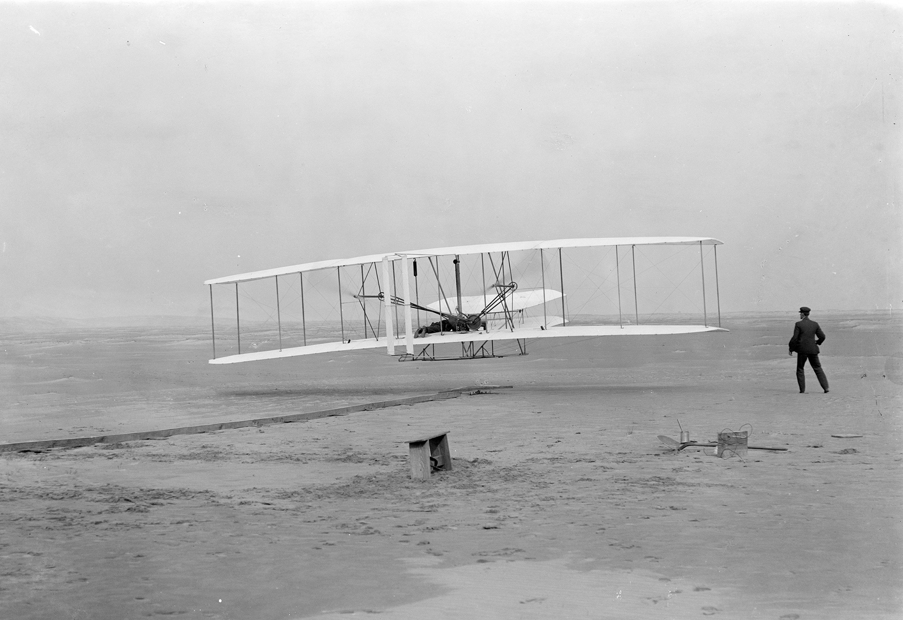

**163/365** Astăzi, pista pentru decolarea şi aterizarea avioanelor are câţiva kilometri lungime, iar cu 114 ani în urmă, la 17 decembrie 1903, zborul unui aparat cu motor pilotat de fraţii Orville și Wilbur Wright pe o distanţă de doar 37 de metri devine un succes care a stat la baza aviaţiei moderne! Tot în aceeaşi zi, după mai multe încercări, Wilbur reuşeşte să zboare timp de 59 de secunde pe o distanţă de circa 260 de metri. Visul omenirii de a zbura, începe să devină realitate! Avionul Kitty Hawk avea lăţimea de 12.3m, lungimea de 6.4m şi o greutate de 340kg, fiind construit din lemn cu aripile din pânză. La fel ca multe alte tehnologii, avioanele au cunoscut o dezvoltare extrem de rapidă, astfel, doar peste câteva zeci de ani, acesta devine cel mai rapid şi sigur tip de transport. Astăzi, avioanele de tipul Boeing sau Airbus pot transporta câteva sue de persoane de la Chişinău la Londra în mai puţin de 3 ore, iar recordul vitezei de zbor este deţinut de Lockheed SR-71 Blackbird cu 3,529km la oră. Totodată, în mai puţin de 60 de ani de la primul zbor, omenirea a reuşit să realizeze primul zbor în cosmos, ajungând să viziteze unicul satelit natural al Pământului - Luna, care se află la 384.400km distanţă!

