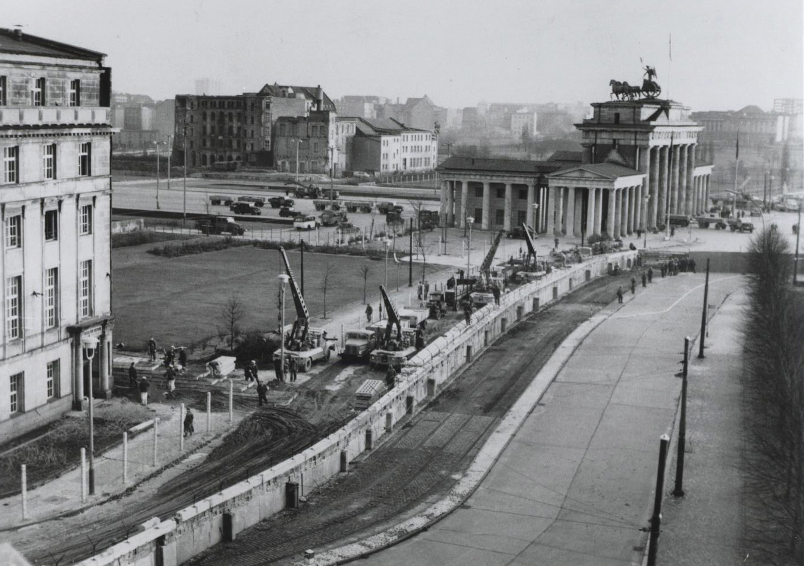

**166/365* Unul din cele mai cunoscute simboluri ale Războiului Rece este **Zidul Berlinului**, care despărţea capiatala Germaniei, familii, fraţi şi surori, copii şi părinţi. A început a fi construit în 1961, după ce peste două milioane de germani din zona comunistă aelegea să meargă în zona controlată de Occident. Pentru prevenirea depopulării statului, conducerea comunistă a căutat o soluţie. Astfel, în dimineaţa zile de 13 august 1961, locuitorii Berilnului s-au trezit cu un şantier în mijlocul oraşului. Autorităţile comuniste începuseră instalarea unui gard de sârmă ghimpată, iar în câteva luni a apărut şi zidul de beton. Bariera care despărţea Berlinul în două părţi consta din două ziduri de beton între care exista "zona morţii" cu o lăţime de 150m păzită de soldaţi cu mitraliere. Începând ca un "simplu" gard de sârmă ghimpată în 1961, până în 1975 bariera a fost transformată într-un sistem complex de baricade şi capcane, lung de 155km de zid şi 127km de gard electric, 302 turnuri de pază, 20 de buncă şi 11.000 soldaţi însărcinaţi cu păzirea acestuia. 
Potrivit datelor oficiale, 138 de persoane au murit împuşcate în încercarea de a trece zidul. Totuşi, acest fapt nu i-a oprit pe alţii să încerce să scape din Germania de Este, astfel, conform unor estimări, peste 10.000 de oameni au reuşit acest lucru prin diferite metode - maşini cu compartimente secrete, tuneluri, actele false.
În noaptea de 9 noiembrie 1989, Günter Schabowski, membru al Politburo, în încercarea de a calma spiritele, anunţa la o conferinţă de presă că restricţiile privind vizele de călătorie vor fi elimenate. Întrebat, când intră în vigoare aceată decizie, el a răspuns "Imediat". Răspunul lui Schabowski s-a răspândit cu viteza luminii, iar oamenii s-au adunat într-un număr destul de mare la punctul de trecere, fiind gata să-şi lase toate bunurile materiale agonisite, doar pentru a putea ajunge în partea de Vest a Berlinului. Harald Jäger, ofițer de gardă la punctul de frontieră din Bornholmer Strasse, în lipsa unor instrucţiuni clare, a luat decizia de a ridica bariera şi a permite oamenilor să treacă.
Deşi data oficială a căderii Zidului este de 9 noiembrie 1989, demolarea acestuia începe în iunie 1990, iar toate punctele de trecere a frontierei au fost desfiinţate la 1 iulie 1990. În octombrie 1990, Germania a redevenit o singură ţară, iar URSS-ul îşi trăgea ultima răsuflare!

