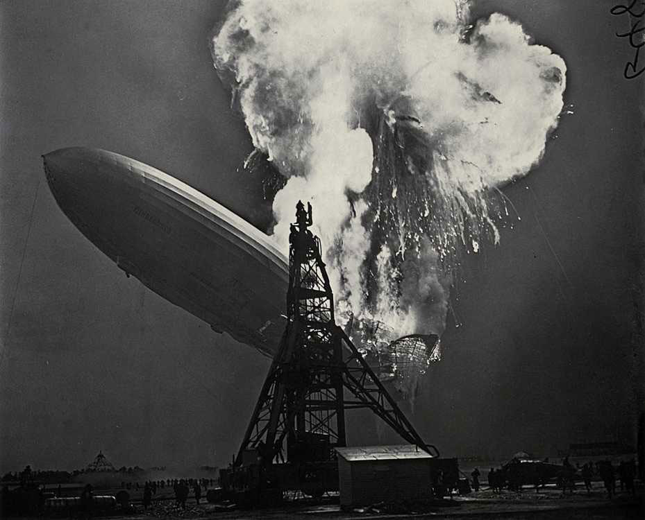

**169/365** Deşi lungimea era de 249m iar înălţimea de 38m, dirijabilului **"Hindenburg"** i-au ajuns doar câteva zeci de secunde pentru a se transforma în scrum! La 6 mai 1937, la New Jersey, a avut loc un accident care şi-a lăsat adânc amprenta în istoria aviaţiei de mai departe. Cu doar un an îaninte, modelul ZR-3 se putea lăuda cu peste un milion de km parcurşi în 576 de călătorii, fără a fi implicat în niciun accident.
"Hindenburgul" era imens, având aproape dimensiunile Titanicului, cu un confort maxim, oferind pasagerilor un salon de servit masă, o sală pentru fumători care era complet izolată, cabine individuale de duş, toate astea fiind situate sub balonul care conţinea două milioane metri cubi de hidrogen. Măsurile de protecţie erau foarte stricte, astfel se confiscau brichetele şi lumânările, iar lucrătorii care aveau acces la zonele cu risc ridicat, erau echipaţi cu cizme de pâslă şi costume din azbest. Până la accident, dirijabilul realizase deja 16 călătorii peste Oceanul Atlantic, şi era văzut ca viitorul călătoriilor transatlantice.
La orele 19:00 seara, în timp ce începe să aterizeze, aparatul de zbor este cuprins de flăcări, motivele nefiind cunoscute nici până în ziua de azi. Totuşi, pe cât de straniu ar părea, din acel incendiu imens, au reuşit să se salveze 62 din cele 97 de persoane aflate la bord. Dirijabilul însă n-a supraveţuit, aceste nave de zbor fiind scoase totalmente din uz.

