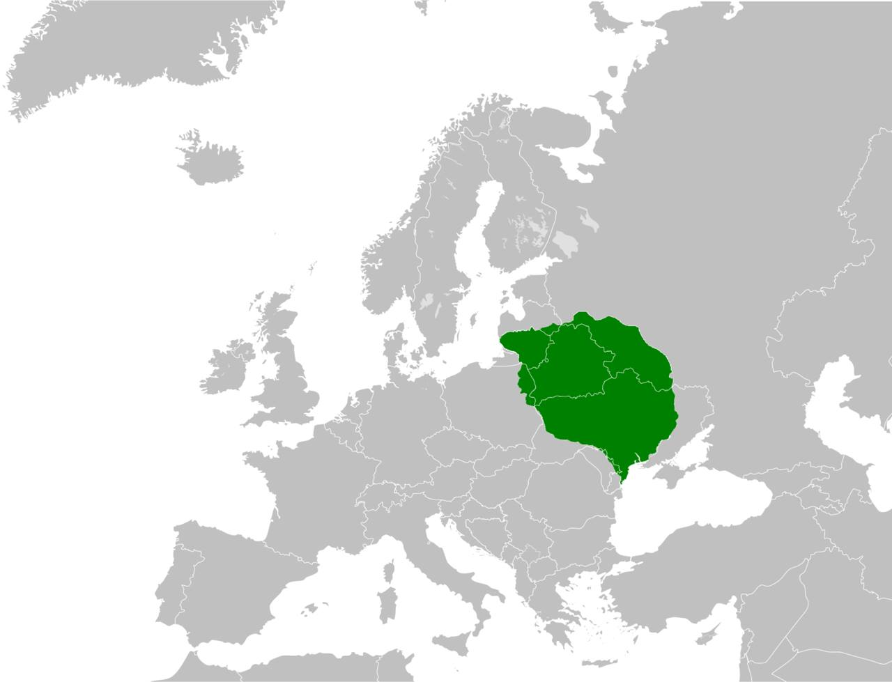

**17/365** Chiar dacă la moment, Lituania este o ţară cu un teritoriu de 65.300km2, în anul 1430 aceasta se întindea pe un teritoriu de peste 930.000km2 (Ucraina, care la moment e a doua ţară ca teritoriu din Europa, se întinde pe cca 603.000km2), fiind cea mai mare de pe teritoriul european la acel moment. Marele Ducat al Lituanie, precum era numit, cuprindea teritorii pe care momentan se află ţări precum Lituania, Belarus, Ucraina, Polonia şi Rusia. Teritoriile vaste au fost acaparate datorită prăbuşirii statului mongol. Interesant este şi faptul că majoritatea oraşelor nu au fost cucerite prin luptă, ci au dorit să devină vasalii Lituaniei. Aşa cum multe din aceste oraşe deja erau vasalii Hoardei de Aur sau al Principatului Moscovei, acestea pur şi simplu au acceptat să schimbe un dur cu unul mai tolerant şi mai puternic. Apogeul Marelui Ducat a fost atins în perioada domnirii lui Vytautas cel Mare, între anii 1392 şi 1430.

