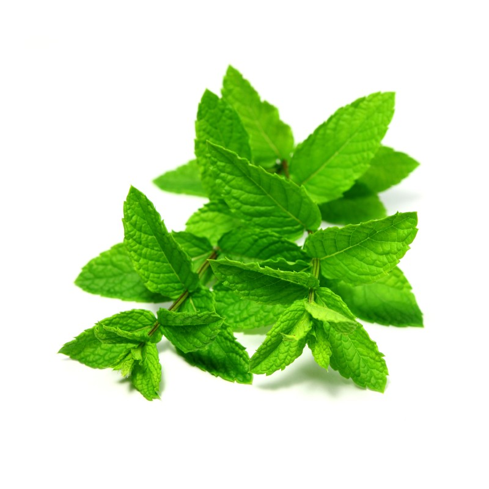

**170/365** Dacă aţi gustat măcar odată gumă de mestecat sau bomboane cu gust de mentă, ştiţi că acestea dau senzaţia de rece. Acest lucru se întâmplă din motiv că menta conţine mentolul care excită receptorii răspunzători de detectarea frigului. Aceştia, la rândul său, transmit informaţia la creier, exact cum o fac la frig. Venele sanguine se îngustează, astfel mai puţin sânge este pompat în zona respectivă. La fel se întâmplă şi în cazul ardeiului iute, care ne dă senzaţia de arsuri.

