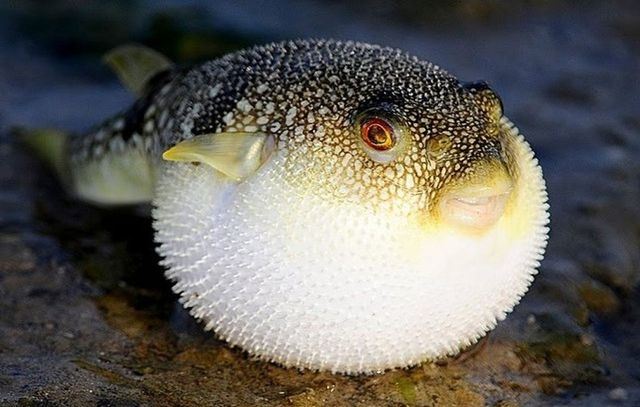

**173/365 Fugu** - delicatesul japonez care te poate băga în pământ la propriu! Dacă nu este gătit corespunzător, pielea şi ficatul acestui peşte conţine cantităţi foarte mari de tetrodoxină. Aceasta atacă muşchii în timp ce persoana e conştientă, iar moartea survine din cauza asfixierii. Totuşi, oamenii de ştiinţă afirmă că peştele în sine nu este otrăvitor, pur şi simplu în hrana sa se găsesc alte veţuitoare care conţin bacteria tetrodoxin-laden, iar fugu este imun la efectele acestuia. Fermele care se ocupă de creşterea acestui peşte, au reuşit să obţină exemplare fără otravă, datorită hranei care nu conţine tetrodoxină. Modul în care acesta este gătit, e reglementat prin lege, şi doar bucătarii care obţin autorizaţie, o pot face. Spre exemplu, în timpul domniei Tokugawa (1603 - 1868), a fost interzis consumul acestui peşte din cauza numărului mare de persoane care mureau hrănindu-se cu fugu.

