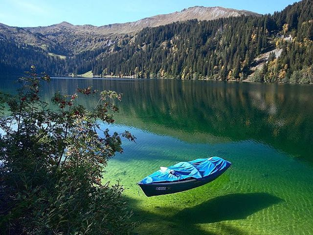

**174/365** Cel mai mare lac din lume este **Lacul Baikal**, care se află în Siberia, Rusia. Conform unor estimări, acesta conţine până la 20% din apa dulce de pe Pământ. Pe lângă faptul că este cel mai mare lac, având o adâncime maximă de peste 1640 de metri, Baikal este şi cel mai vârstnic, având o vechime de peste 20 milioane de ani. Suprafaţa lacului este de aproximativ 31.700km (un pic mai mic ca Republica Moldova şi mai mare ca Belgia), şi conţine aproximativ 23.000km cubi de apă. În lac îşi revarsă apele 336 de râuri, şi doar râul Angara se revarsă din lac, fiind un afluent al râului Enisei.
Datorită aflării geografice, apele lacului nu reuşesc să se încălzească prea mult nici măcar vara, rar depăşind temperatura de 12 grade cu plus. Totodată, în lac vieţuieşte o specie de focă care nu există în alt loc - foca de Baikal. Aceste mamifere au lungimea unui om adult şi pot cântări şi peste 100kg. În total, în lac vieţuiesc peste 800 de specii de animale şi peste 245 de specii de plante.

