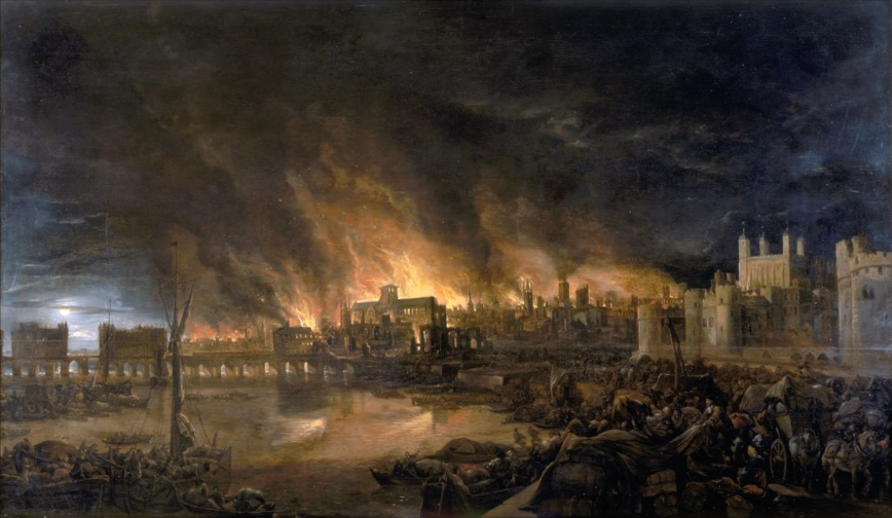

**176/365** Ultimele zile la Londra se vorbeşte intens despre incendiul care a luat viaţa a cel puţin 79 de persoane. Din păcate, capitala Angliei a mai trecut prin astfel de situaţii dificile, spre exemplu, în anul 1666, Marele Incendiu din Londra, precum a fost numit, a distrus partea centrală ale oraşului într-un incendiu care a durat patru zile. Focul a reuşit să transforme în scrum circa 13.200 de case, adăpostul a 70.000 de oameni din populaţia de 80.000. Oficial, numărul persoanelor decedate în acel incendiu a fost de şase persoane, totuşi, se pare că decesul celor săraci şi din clasa din mijloc şi a celor carbonizaţi complet, nu s-ar fi înregistrat nicăieri.
Incendiul a izbucnit la brutăria lui Thomas Farriner de pe Pudding Lane, după miezul nopţii, şi s-a răspândit spre vest. Datorită materialelor din care erau construite casele, lemn şi acoperişuri din paie, focul a înaintat foarte repede. Deşi aceste materiale au fost interzise de mai multe ori, preţul mic al acestora erau motivul principal a folosirii lor în construcţii. Pompierii au propus ca unele case să fie distruse, pentru a împiedica focul să se răspândească, gazdele însă au fost împotrivă, iar primarul Londrei, unica persoană care putea merge împotriva lor, era stăpânit de panică, şi era la fel împotriva acestei decizii.
Au fost răspândite unele zvonuri precum că străinii aprind intenţionat casele, iar ura oamenilor s-a răspândit pe francezii şi olandezii care locuiau la Londra, (ţări cu care Anglia luptase în al Doilea Război Anglo-Olandez), şi au fost victimele linşajelor şi a violenţelor. Marţi incendiul a distrus capitala Sf. Pavel şi ameninţa curtea lui Carol al II-lea de la Whitehall.
Marţi seara, vântul încetase să mai bată puternic, iar sfaturile pompierilor de a distruge careva case pentru a crea o linie de apărare împotriva focului au fost auzite, astfel că incendiul fusese luat sub control.
Chiar dacă erau numeroase propunerile de a schimba radical planul oraşului, Londra fusese reconstruită pe acelaşi plan al străzilor ca şi până la incendiu.

