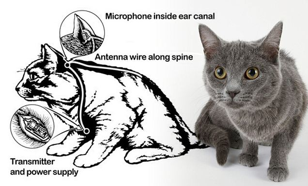

**177/365** Informaţia te face mai puternic, mai ales pe timp de război. În anii 1960, serviciile secrete americane CIA, au proiectat un sistem de spionare a ambasadelor sovietice. **Proiectul "Acoustic Kitty"** consta în implanturile introduse în corpul pisicilor pe cale chirurgicală, constând din baterii, transmiţătoare radio, antene şi microfoane. Microfoanele erau introduse în urechile pisicilor, transmiţătoarele la baza craniului, iar antena se afla sub pielea animalului. Totuşi, proiectul a fost un eşec. Pisicile sunt animale care practic nu se dau dresării, astfel nu putea fi trimisă în locuri concrete, iar prima "ieşire" în teritoriu, a fost un eşec. O pisică fusese lăsată într-un parc, în apropiere de Ambasada URSS la Washington. Conform unor informaţii, pisica a fost lovită de un taxi şi a decedat, însă Robert Wallace afirma într-un film documentar că pisicii i-au fost îndepărtate implanturile şi a trăit încă mulţi ani după aceasta. Următoarele încercă la fel s-au soldat cu eşec.
Conform unor estimări, în acest proiect au fost investiţi între 15 şi 25 milioane de dolari, iar proiectul a fost stopat.

