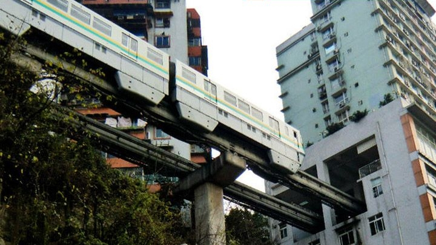

**178/365** Ce aţi spune, dacă fiind în vizită la un prieten, acesta v-ar invita să faceţi o plimbare în altă zonă a oraşului, aşa că ar fi bine să urcaţi câteva etaje din blocul în care locuieşte pentru a lua metroul? V-aţi gândi că aberează? Ar fi bine să nu trageţi concluzii pripite. Spre exemplu, în China, în oraşul Chongqing, care este cel mai mare municipiu atât ca suprafaţă cât şi la numărul populaţiei din cele patru municipii chineze, liniile de metro au fost proiectate chiar prin blocurile locative. În anul 2004, când fusese construit primul bloc cu o linie de metro care trece prin el, apartamentele se vindeau la preţ redus, pentru că nimeni nu mai făcuse aşa ceva până atunci, şi nu se ştia dacă cineva o să dorească să le cumpere. Totuşi, din cauza că acele trenuri folosesc motoare foarte silenţioase, acestea practic nu fac zgomot, iar între timp apartamentele în acel bloc, au crescut mult în preţ, pentru că locuitorilor le place să poată folosi metroul care se află chiar în blocul în care locuiesc.

Video: https://youtu.be/ygrNedI7l8c

