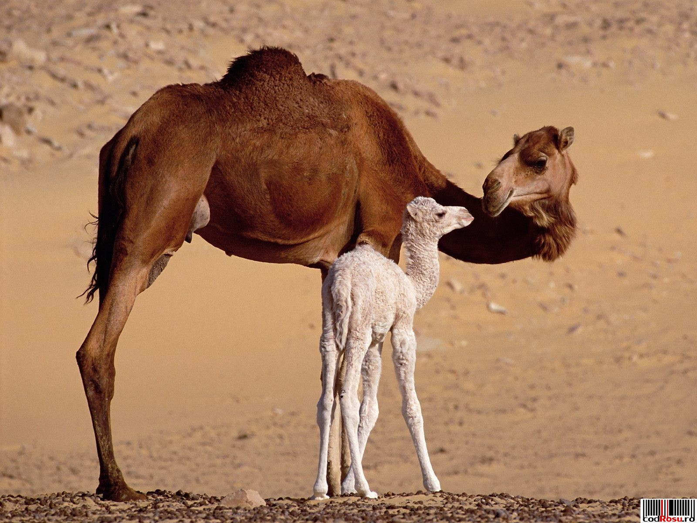

**179/365** Unii încă mai cred că cocoaşa de pe spatele cămilei este folosită pentru depozitarea apei. De fapt, ceea ce o face pe cămilă unică, este sistemul de circulaţie sanguină care îi permite să bea apxoximativ 100 de litri de apă în zece minute. Ca să nu-şi piardă lichidele din corp, cămila îşi poate creşte temperatura corpului cu până la 6 grade Celsius, pentru a evita transpirarea. Nu mai există alt animal care poate face asta.
Cât ţine de cocoaşă, aceasta reprezintă un ţesut din care cămila îşi obţine energie când hrana lispeşte sau nu este îndeajuns.

