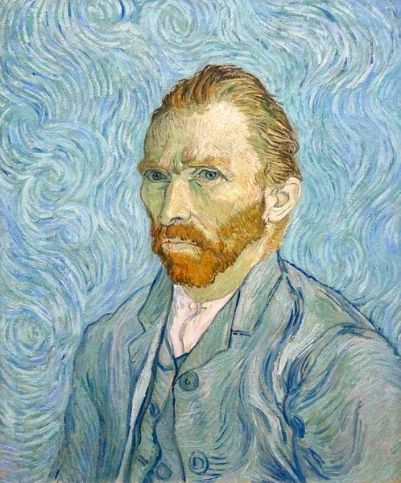

**18/365** Deşi astăzi **Vincent Van Gogh** este unul din cei mai cunoscuţi pictori din istorie, acesta nu a fost apreciat în perioada vieţii sale, precum multe alte persoane remarcabile. Născut în anul 1853 în Olanda, îşi petrece copilăria la Haga, după care pleacă în Anglia, unde vrea să devină pastor, precum tatăl său, iar pentru asta, pleacă în Belgia ca misionar, într-o regiune minieră. Atunci începe să schiţeze primele sale lucrări, iar în 1885 pictează prima sa lucrare de succes "Mâncătorii de cartofi". Mai târziu, în 1886, se mută la Paris, unde face cunoştinţă cu impresioniştii francezi. În timpul vieţii sale, realizează peste 2.000 de lucrări, dintre care - 900 de picturi. Deşi legenda spune că a reuşit să vândă o singură lucrare, se pare că lucrurile nu stau chiar aşa, dar totuşi, numărul vânzărilor a fost unul destul de mic, iar financiar era susţinut de fratele său, Theo. Suferă de boli psihice, care au influenţat direct lucrările sale, şi care se crede că l-au făcut să se sinucidă, în iulie 1890, împuşcându-se cu o armă în piept, fapt care este pus la îndoială de unii istorici, care cred că a fost împuşcat din greşeală de doi băieţi, iar acesta şi-ar fi asumat răspunderea, pentru a-i apăra.

