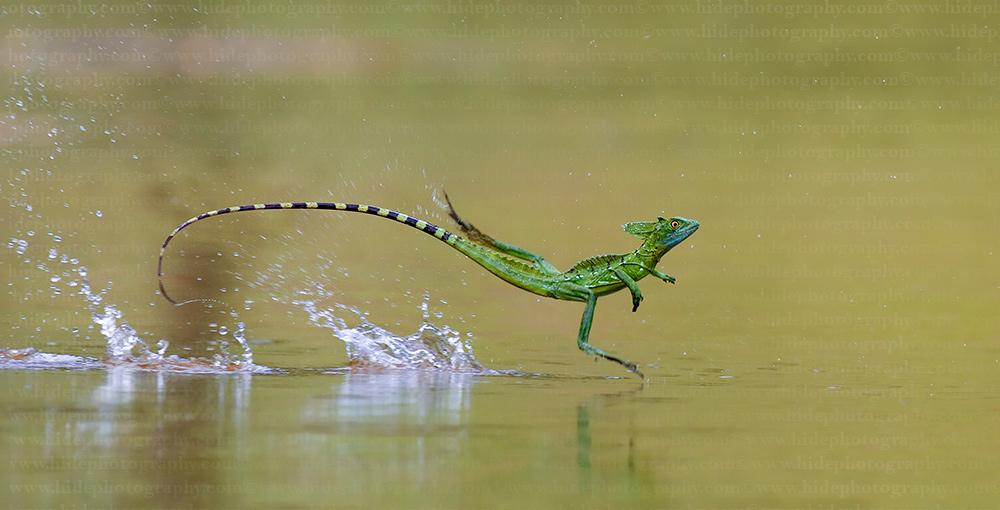

**180/365** Numită şi Şopârla Iisus Cristos, **Şopârla Basiliscus** poate alerga pe suprafaţa apei între 5 şi 10 metri cu o viteză de circa 1.5 metri pe secundă, fără să se scufunde. Datorită membranei dintre degetele sale, aceasta reuşeşte să planeze pe suprafaţa apei pentru a scăpa de atacator. Dacă prin apropierea sa nu se găseşte nicio suprafaţă acvatică, şopârla se scufundă în nisip. Trăieşte în America Centrală şi de Sud în apropierea râurilor sau a bălţilor. Poate măsura de la 20 până la 70 cm şi se hrăneşte cu flori, fructe, iar uneori chiar şi cu reptile sau păsări mici. Media de viaţă este de aproximativ 7 ani. Femelele depun între 10 şi 20 de ouă de câteva ori pe an. Ouălele sunt îngropate în nisip şi au nevoie de trei luni pentru a ecloza, iar puii cresc fără ajutorul părinţilor.

