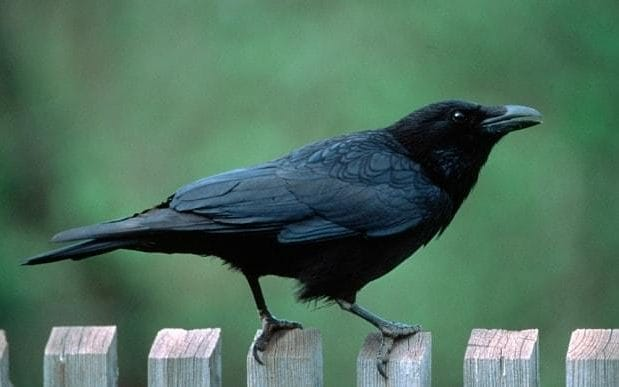

**181/365** Dintre toate păsările, **cioara** are cel mai mare creieri relaltat la dimensiunile corpului, şi totodată sunt cele mai deştepte păsări. De exemplu, o cioară e de cel mult de două ori mai mare decât un porumbel, pe când creierul, este de patru ori mai mare. Unica vieţutoare care are proporţia creier-corp mai mare decât la cioară, este omul! Cu excepţia omului şi a maimuţelor, cioara este unica vieţuitoare capabilă să folosească uneltele în căutarea hranei. Conform rezultatelor testelor, cioara este la fel de inteligentă ca delfinii şi maimuţele. Pot folosi beţe de diferite lungimi pentru a ajunge la hrana la care nu ajung direct. Totodată, în cadrul Universităţii Oxford, unui grup de ciori li s-au prezentat mai multe obiecte: un şarpe de cauciuc, un LED aprins, un far de bicicletă, şi deşi nu au manifestat frică la vederea acestora, ciorile au fost precaute şi au folosit beţe sau bucăţi de carton pentru a intra în contact cu noile obiecte.
Sunt păsări sociabile şi clocesc în colonii. Spre exemplu, în Scoţia a fost descoperită o colonie cu peste 65.000 de exemplare.

