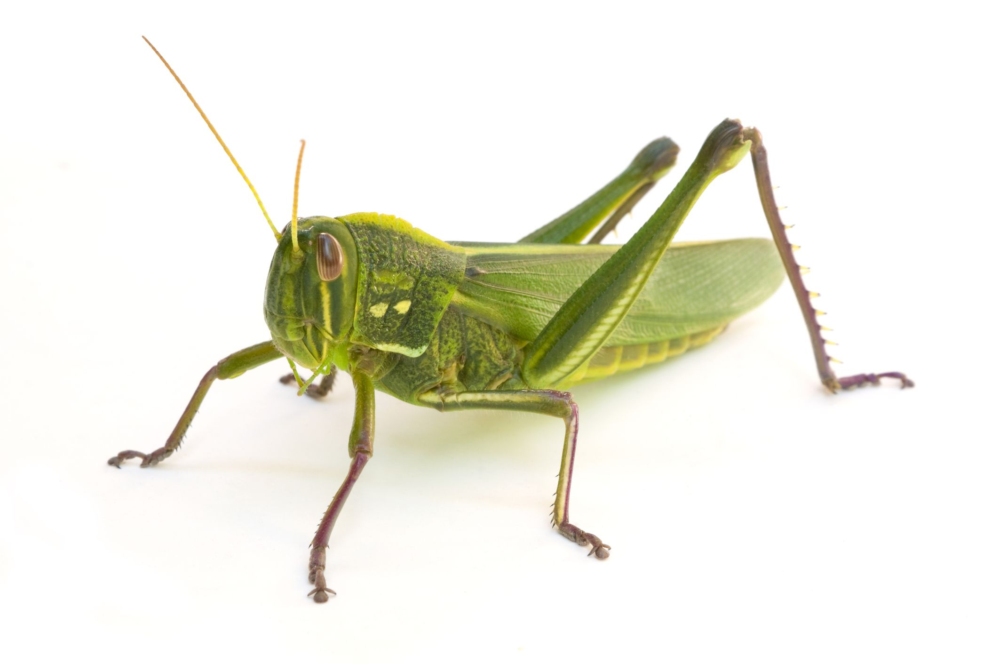

**182/365** Deşi mici, insectele, în număr mare, pot produce pagube considerabile. În 1874, în Statele Unite ale Americii, invazia lăcustelor au îngrozit chiar şi specialiştii în domeniu, când într-o dimineaţă din luna iulie, un roi de insecte au acoperit oraşul. În doar câteva zile, în Kansas nu mai rămăseseră niciun fir de iarbă, nici o frunză pe copaci. Oamenii au încercat să omoare insectele aruncându-le în foc, însă din cauza numărului enorm, această metodă nu avea niciun efect. Fermierii încercau fel de fel de metode, inventau aparate speciale pentru distrugerea lăcustelor, dar fără folos. Pagubele au fost estimate la peste 200 de milioane de dolari, iar fermierii erau înfricoşaţi de gândul că miriadele de larve depuse de lăcuste, au să atace din nou. Totuşi, spre marea lor bucurie, din cauza frigului, toate larvele au decedat.

