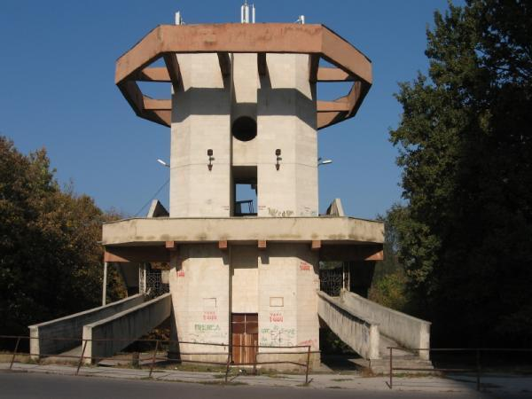

**183/365** În anul 1988, la Chişinău a fost dat în exploatare **telefericul** care lega străzile Calea Ieşilor şi Nicolae Costin din sectorul Buiucani. Construcţia acestuia a costat 7 milioane de ruble, iar costul unei călătorii era 50 de copeici. În 1996 însă, telefericul a fost închis. Motivul oficial era că acesta nu mai aducea profit, însă o altă versiune spune, că acesta a fost închis după ce un bărbat s-a aruncat din cabina telefericului şi a decedat. Totuşi, primăria Chişinăului a discutat posibilitatea reparării acestuia cu implicarea unor investitori, însă până când fără vreun succes. Acesta a fost unicul teleferic din Republica Moldova.

