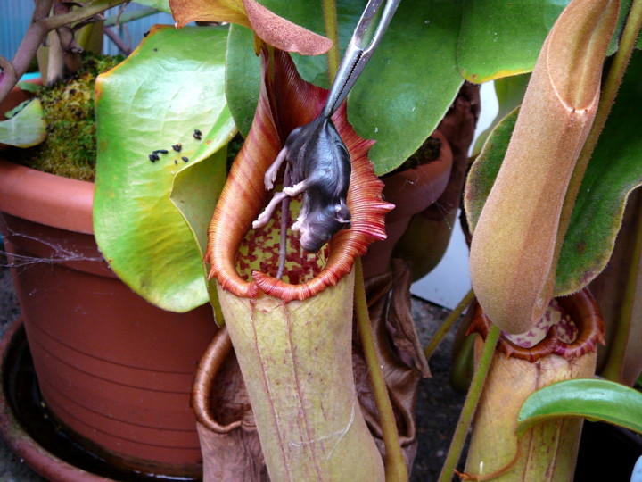

**186/365 Plantă carnivoră**? Există aşa ceva? Desigur! Dionaea Muscipula se hrăneşte cu insecte, prinzându-le când acestea doresc să se înfrupte din nectarul secretat de plantă, care are nevoie de doar 0.1 secunde pentru a-şi închide lobii. Odată prinsă în capcană, insecta este digerată timp de câteva zile cu ajutorul lichidului enzimatic. Muştele, ţânţarii şi păianjenii fac parte din meniul acestor plante. Totuşi, planta Nepenthes în cazuri foarte rare, reuşeşte să prindă şoricei, broscuţe sau chiar păsări de mici dimensiuni.

