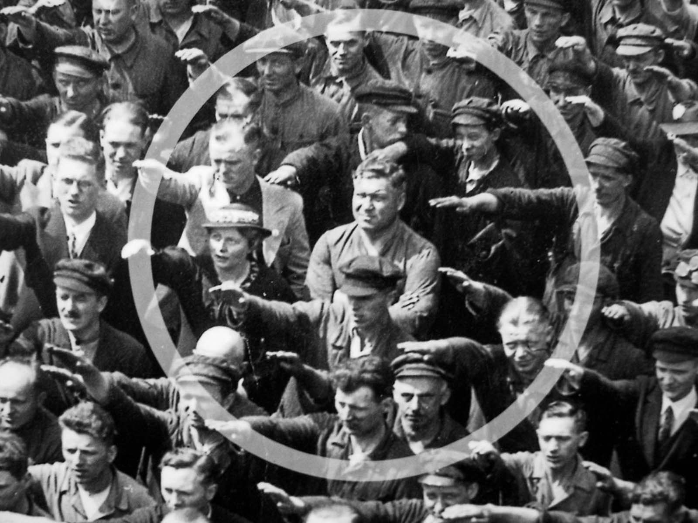

**189/365** Numărul fotografiilor făcute pe parcursul istoriei la sigur este enorm. Şi dacă încă 10 ani în urmă, aparatele digitale începeau a deveni accesibile pentru orice muritor de rând, astăzi camerele performante instalate în telefoane, ne permit să fotografiem orice, în orice moment, în orice loc. Totuşi, din miliardele de fotografii existente, numărul celor care au făcut istorie, nu reprezintă la sigur nici a zecea parte a unui procent din total.
**August Landmesser** a fost un adopt al partidului nazist la care s-a alăturat în 1931. Doi ani mai târziu, acesta îşi întâlnise dragostea vieţii, Irma Eckler, o fată de origine evreiască, iar în 1935 o ceruse de soţie. După ce logonda lor a fost descoperită, August a fost dat afară din partid.
În 1936, când participa la lansarea unui nou vas german, a fost surprins într-o fotografie, cum era unicul din mulţime care a refuzat să-l salute pe Hitler. În 1937, fusese condamnat pentru "murdărirea rasei", acesta argumentând că nu ştia sută la sută dacă soţia sa era evreică. A fost achitat la 27 mai 1938, din lipsa probelor, însă a fost din nou arestat la 15 iulie 1938. Fusese condamnat la 2,5 ani la muncă silnică în lagărul de concentrare de la Borgermoor.
Irma, fusese închisă la închisoarea Fuhlsbüttel, unde născuse cea de a doua fiică a lor. Apoi, fusese trimisă la câteva lagăre de concentrare, unde i-au fost luate ambele fiici, care au fost adoptate. Irma le-a scris scrisori până în 1942, atunci până când se presupune că fusese omorâtă la Bernburg.
August fusese eliberat la 19 ianuarie 1941, iar în 1944 fusese înrloat într-un detaşament numit "999 infanterie". Prost echipaţi şi trimişi în cele mai dificile operaţiuni, era practic detaşamentul morţii. A fost dat dispărut la 17 octombrie 1944, în timpul luptelor din Croaţia.
Gestul său plin de curaj a demonstrat că dragostea pentru soţia sa conta mai mult decât propria viaţă, rămânând în istorie drept un exemplu demn de urmat!

