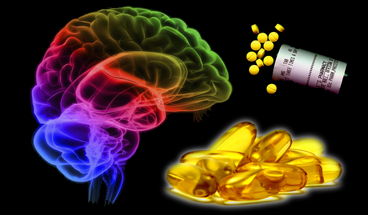

**192/365** Unul din cele mai mare mistere legate de om este **efectul Placebo**. Spre exemplu, cazul domnului Wright (numele adevărat nu este făcut public), documentat în totalitate, demonstrează pe viu acest efect. Domnului Wright, un american bolnav de cancer limfatic, îi fusese administrate diferite tratamente, dar fără rezultat - tumorile continuau să se extindă. Doctorii i-au spus atunci despre un nou medicament anticancer: Krebiozen. După câteva luni, pacientul a părăsit spitalul complet sănătos. Totuşi, după ce a aflat că medicamentul în care el îşi pusese toate speranţele, nu există, acesta s-a stins din viaţă în doar câteva zile.
Deşi e de la sine înţeles că starea de spirit a pacientului în lupta cu boala e foarte importantă, totuşi, pot tratamentele fără substanţe active să aibă rezultat? Studiile au demonstrat că în unele cazuri acest fapt este posibil. Pastile de zahăr sau injecţiile cu zer fiziologic au dat rezultate în lupta cu depresia, hipertensiunea arterială, ulcerul sau boala Parkinson.
Tratamentele pe bază de "licori miraculoase" au fost practicate de la începturile medicinei de fel de fel de vraci şi şarlatani. Până nu demult însă, doctorii care au studiat ani de zile pe băncile facultăţilor, nu vroiau să accepte nici gândul că pacienţii s-ar putea vindeca şi singuri, prin puterea gândului. În ultimele câteva decenii, ideea că efectul Placebo totuşi are efect, a fost acceptată, iar medicii, biologii, psihologii şi siociologii lucrează împreună pentru a-l înţelege.
Unii pacienţi îşi ameliorează starea de sănătate sau se vindecă doar prin simplu fapt că au încrederea într-un anumit medicament prescris de doctori, chiar şi mirosul cabinetului medical îi face să se simtă mai bine. Exită şi citate în literatura de specialitate, descriind anumite simpotome care au dispărut, deşi tratamentul nu era specific patologiei respective.
În anii 1950, Henry Knowles Beecher, a realizat peste 20 de studii pe această temă. El a descoperit că o treime din pacienţi şi-au îmbunătăţit sănătatea după o terapie falsă, o proporţie acceptată astăzi de majoritatea specialiştilor. Totuşi, unii contestă acest procentaj, precum că ar fi de fapt mai mare, iar alţii din contra spun că procentajul ar fi mai mic, argumentul lor fiind că unele boli, precum gripa, trec de la sine, iar durerea nu poate fi măsurată.
Profesorul Dan Ariely de la Massachusetts Institute of Technology, SUA, au descoperit o latură financiară a efectului Placebo. 82 de persoane au fost supuşi unui test, iar jumătate din ei au primit o broşură care-i informa că li se v-or administra medicamente cu valoarea de 2.5$ pastila, iar cealaltă jumătate că v-or fi trataţi cu medicamente de doar 10 cenţi. În realitate, ambele grupuri au primit aceeaşi substanţă, vitamina C, însă rezultatele au fost diferite. În cazul pastilelor scumpe, 85% au declarat că simt o ameliorare, în timp ce în celălalt grup, doar 61% au spus că se simt mai bine.
Pe lângă costul medicamentului, unele studii au demonstrat că şi aspectul medicamentelor are efect. Medicamentele mai mari, colorate, par să îmbunătăţească mai bine starea de sănătate decât celea de dimensiuni mici şi banale. De asemenea, tratamentele complexe, injectabile sau în mai mulţi paşi, dau rezultate superioare.
Efectul Placebo dă rezultate chiar şi în chirurgie! Echipa psihologului Cynthia McRae de la Universitatea din Denver, SUA, a demonstrat că doar gândul că au fost operaţi a ajutat bolnavii de Parkinson să-şi îmbunătăţească starea de sănătate. Cercetătorii au împărţit pacienţii în două grupe, dintre care o grupă a fost operată cu adevărat şi li s-au implantat în creier neuroni care să producă dopamină, iar cealaltă jumătate pur şi simplu au fost tăiaţi şi cusuţi la loc. Pacienţii au fost monitorizaţi, iar rezultatele au fost de-a dreptul şocante: grupele aveau aproape aceleaşi rezultate.
Gândirea pozitivă pot determina organismul să treacă prin schimbări reale care duc la însănătoşire. Atunci când se manifestă efectul Placebo, în zona din creier numită nucleus accumbens, asociată cu bucuria şi dependenţa, are loc o creşteră a cantităţii neurotransmiţătorului dopamina. Schimbări importante au fost observate şi în talamus, în cortexul cingulat anterior, cortexul prefrontal, centrul raţiunii. Aceste zone se activează chiar şi când pacientul doar se aşteaptă să-i scadă durerea. În plus, se pune în mişcare un întreg mecanism care reduce activitatea zonelor din creier care răspund de detectarea durerii.

http://www.descopera.ro/stiinta/4238441-efectul-placebo-miracolele-mintii

