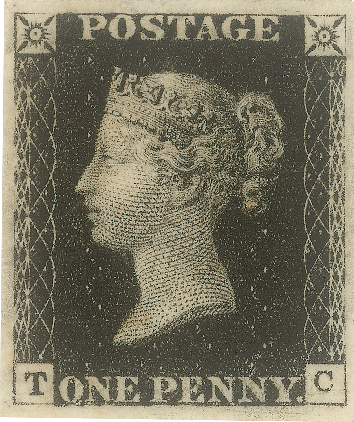

**194/365** Ca şi multe alte lucruri, **timbrele** tot în Marea Britanie au fost inventate. Primul timbru, Penny Black, a fost emis la 6 mai 1840.
Timbrul serveşte drept plată a unui serviciu poştal şi este lipită pe un plic, iar mai apoi este anulată cu o ştampilă înainte de a ajunge la destinatar, pentru a nu putea fi refolosită, iar unele timbre sunt imprimate direct pe plic. Preţul acestora variază de la câţiva cenţi pentru un timbru tipărit într-un număr mare, pân la sute de mii de dolari pentru un timbru de colecţie. Colecţionarea timbrelor se numeşte filatelie şi şi a apărut la scurt timp după apariţia primului timbru. Spre exemplu, în 2012, Poşta României deţinea o colecţie de peste 15 milioane de timbre cu o valoare de peste 700 de milioane de euro.
Interesant este şi faptul că 35% din PIB-ul Butanului în 1973 provenea din vânzările timbrelor. Tot în Butan se produc unele din cele mai originale timbre din lume - tridimensionale, parfumate, din mătase sau poleite cu aur. Printre cele mai scumpe timbre din lume este şi timbrul românesc "Cap de Bour" de 5 parale care a fost vândut în 2015 la preţul de 700.000 de euro unui colecţionar de origine israeliană.

