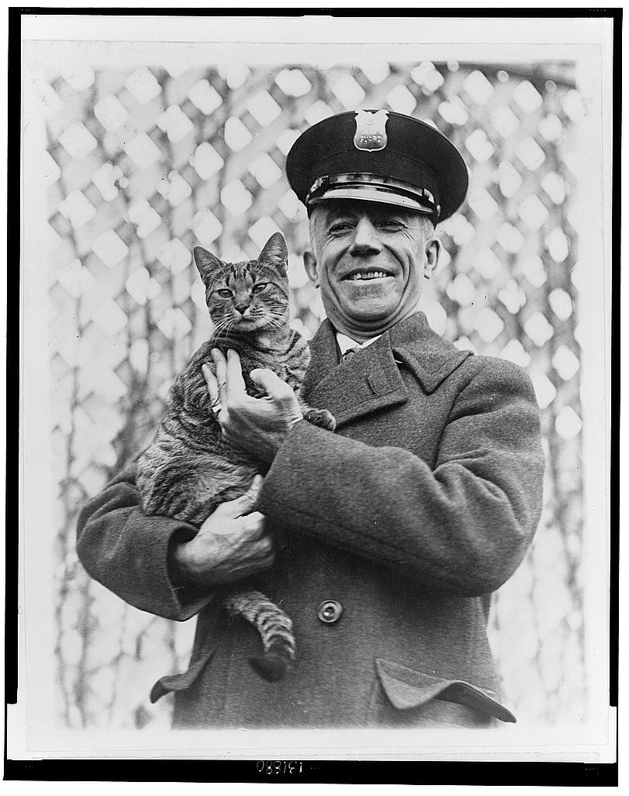

**196/365** John Calvin Coolidge Jr., al 30-lea preşedinte al Statelor Unite al Americii în perioada 1923 - 1929, a fost un mare iubitor de animale. Din acest motiv, Casa Albă aproape că se transformase într-un zooparc în care trăiau diferite păsări, câini de diferite rase, râsul Smokie, iar leul, ursul şi hipopotamul pitic i-au fost aduse în dar de colegii săi din alte ţări. Pe lângă aceste vietăţi, mai trăiau şi doi motani - Blackie şi Tiger. Cel din urmă era favoritul preşedintelui. Tiger adora să asiste la reuniunile din Casa Albă, dar şi să se plimbe unde-l duceau ochii. Într-una din zile, ieşind la plimbare, motanul favorit al preşedintelui nu se întorsese acasă câteva zile consecutiv. După multe încercări zadarnice de al găsi, preşedintele a hotărât să se adreseze după ajutorul oamenilor prin intermediul radioului. În scurt timp, motanul fusese găsit şi întors la Casa Albă. După acest incident, pentru ambii motani fuseseră confecţionate medalioane speciale cu inscripţia "Casa Albă". Totuşi, după ce Tiger se pierduse din nou, acesta nu a mai fost găsit niciodată, unii speculând că ar fi ajuns o pradă uşoară pentru colecţionari, care ştiau cine e stăpânul motanului.

