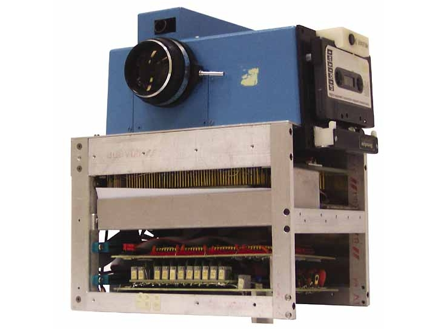

**197/365** Astăzi e foarte dificil să mai impresionezi pe cineva cu o cameră foto. Camerele de fotografiat digitale sunt prezente în buzunarele noastre fiind încorporate în telefoanele mobile de mai bine de zece ani. Istoria acestora începe în decembrie 1975 când este făcută prima fotografie digitală pe un aparat Kodak. Acesta fusese inventat de Steven Sasson, cântărea 3.6kg, iar fotografiile aveau o rezoluţie de 100x100 pixeli, adică 0.01MP. Aparatul memora imaginea pe bandă magnetică, iar pentru fiecare imagine era nevoie de 23 de secunde pentru a fi salvată.

