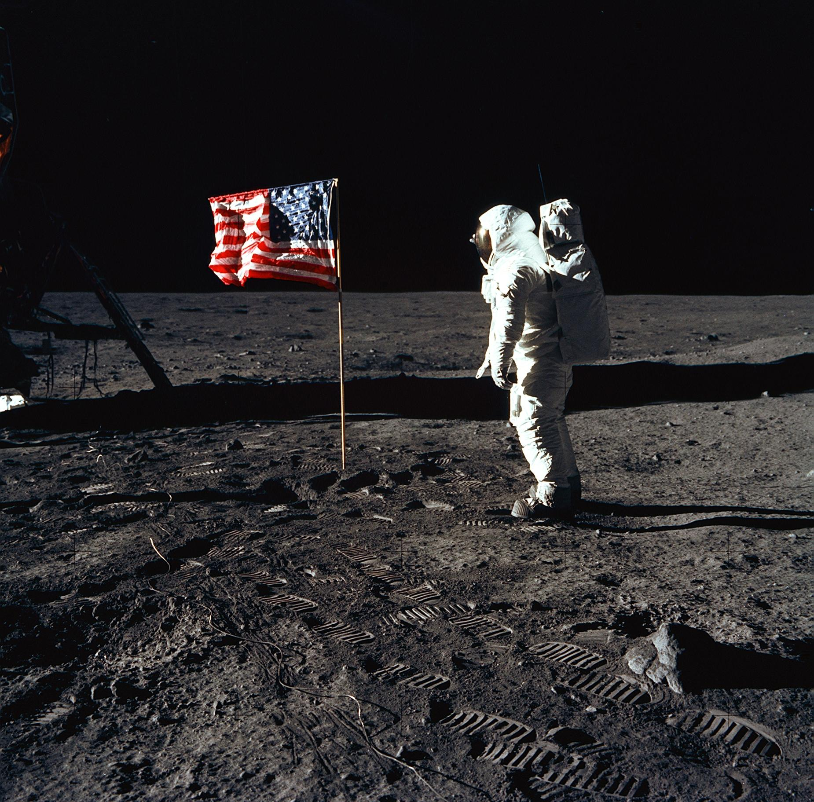

**199/365** "Un pas mic pentru om, dar un salt mare pentru omenire" - anume aceste cuvinte le-a rostit Neil Armstrong înainte de a păşi pentru prima dată pe suprafaţa unicului satelit natural al Pământului - Luna. La 16 iulie 1969, echipajul format din Neil Armstrong, Edwin Buzz Aldrin şi Michael Collins şi-a început misiunea Apollo 11, una din cele mai importante şi mai dificile misiuni din istorie. Racheta cu o lungime de 111 metri fusese lansată de la Centrul Spaţial Kennedy din Florida. După patru zile, la orele 20:18 GMT, Aldrin a confirmat că modulul Eagle a aterizat pe lună. Solul Lunei a fost atins peste câteva ore de către Neil Armstrong, care a fost urmat de Edwin Aldrin la o distanţă de 20 de minute. Peste 500 de milioane de oameni îi urmăreau în direct la televizor. Astronauţii au colectat 22kg de roci, dar au lăsat pe Lună flagul american şi o placă de oţel cu un mesaj de pace, semnat de preşedintele SUA, Richard Nixon. La 24 iulie, misiunea a luat sfârşit, iar echipajul a făcut cale întoarsă.

