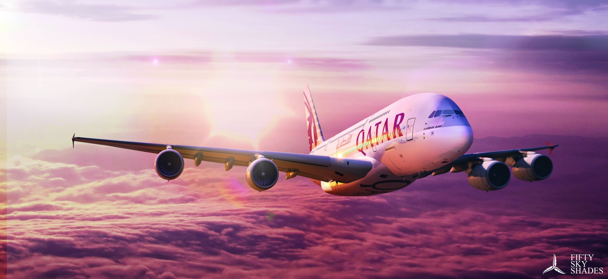

**2/365** **Cea mai lungă cursă aeriană comercială fără escală**, este operată de compania Qatar Airways, pe ruta Auckland International Airport (AKL) – Doha International Airport (DOH) pe o distanţă de 14526km în timp de 17h15m (octombrie 2016).

