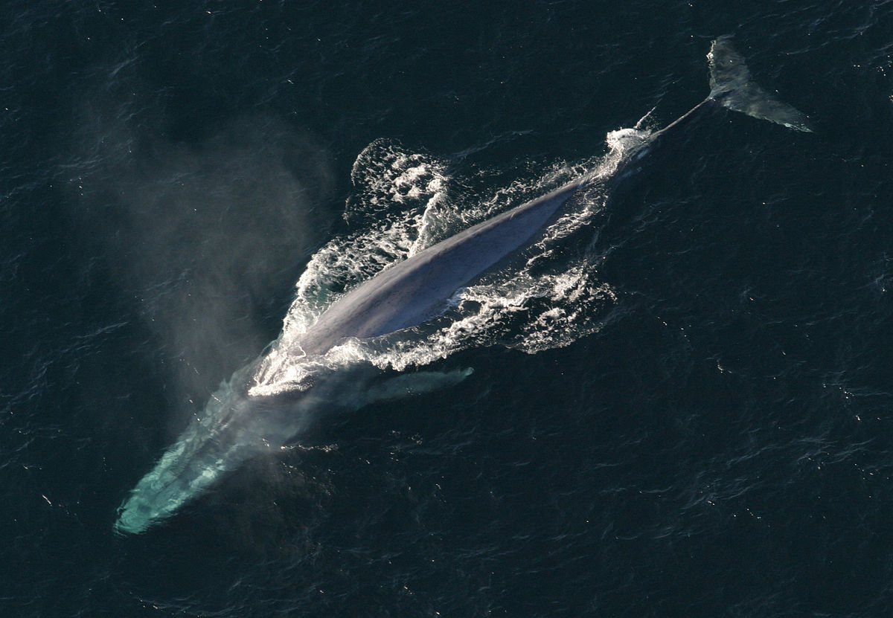

**200/365** Cu o lungime de peste 30 de metri şi o greutate de până la 170 de tone, balena albastră este cel mai mare mamifer existent. Deşi enorme, acestea pot atinge viteze de până la 50km/h, dar în mod normal înoată cu o viteză de circa 20km/h. Datorită formei sale hidrodinamice, balena nu consumă multă hrană. În plus, deşi e cel mai mare animal, balena se hrăneşte cu zooplancton, format din protozoare, viermi, moluşte, larve. Dă naştere unui pui odată la 2-3 ani, perioada gestaţiei fiind de 10-12 luni, şi îl hrăneşte cu lapte. Puiul nou născut cântereşte aproape trei tone, cât un hipopotam matur, şi bea 400-600 litri de lapte pe zi. În doar jumătate de an îşi dublează lungimea şi încetează să mai fie alăptat.

