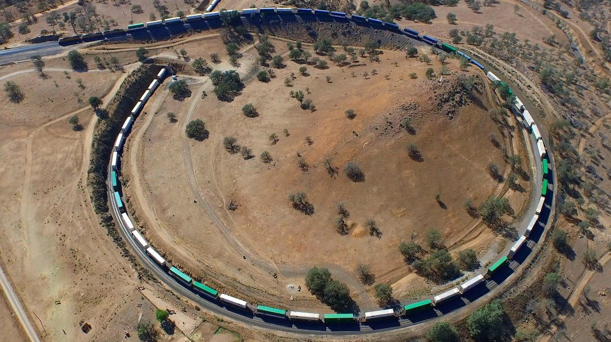

**201/365** Cel mai lung tren din lume, a pornit la drum în iunie 2001, în Australia. Lungimea totală a acestuia este de 7km şi 300m, iar masa totală împreună cu încărcătura de minereu de metal era de peste 100.000 de tone. 682 de vagoane erau trase de opt locomotive, plasate de-a lungul trenului.

