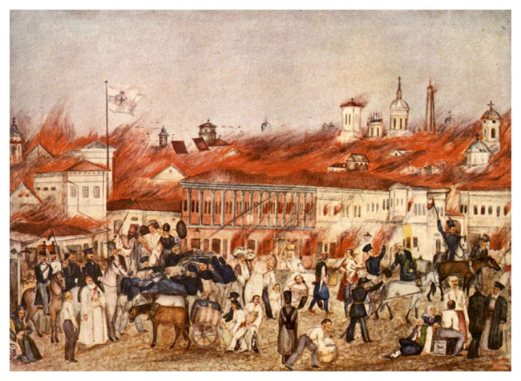

**207/365** Multe oraşe au ars aproape în totalitate din cauza materialelor de construcţie care erau folosite acum câteva sute sau mii de ani. Şi Bucureştiul a avut parte de câteva incendii, iar cel mai devastator a rămas în istorie cunoscut sub numele de Focul cel Mare. Incendiul a izbucnit la 23 martie 1847 şi a cauzat distrugerea a peste 1850 de clădiri din cea mai populată şi bogată parte a oraşului. Cauza acestuia a fost joaca unui copil, care a împuşcat spre podul şopronului plin cu fân. Incendiul s-a răspândit cu repeziciune din cauza vântului şi a clădirilor mici şi înghesuite, construite din lemn. 15 persoane şi-au pierdut viaţa. Incendiul a fost stins datorită pompierilor care au fost ajutaţi de soldaţi, dar şi de faptul că în alte zone, distanţa dintre case era mai mare, ceea ce a împiedicat focul să se răspândească rapid.
Pentru ajutorarea sinistraţilor, au fost organizate spectacole de binefacere şi au fost lansate apeluri atât în ţară, cât şi peste hotare. Oraşul a fost reconstruit după principii moderne, iar atelierele meşteşugăreşti unde se lucra cu focul au fost scoase din zona centrală. Totodată au fost instalate câteva cişmele şi conducte de apă. În următorul an, a fost înfiinţat primul serviciu permanent de pompieri.

