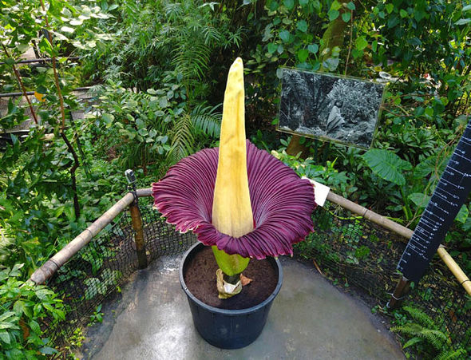

**208/365** De obicei, florile sunt asociate cu parfumul plăcut şi cu frumuseţea exterioară. Totuşi, unele flori, nu aţi dori să le mirosiţi din cauza că acestea au un "parfum" nu chiar plăcut. Spre exemplu, "Floarea Cadavru" miroase exact ca un cadavru în stare de putrefacţie. Această floare poate creşte până la trei metri înălţime, iar datorită mirosului, atrage muştele şi gândacii care depun oăulele pe hoiturile animalelor, pentru a fi polenizată. Exact la fel procedează şi Stapelia Gigantea, care miroase practic ca şi Floarea Cadavru, şi are aceeaşi menire, de a atrage insectele.Deşi orhideele sunt socotite unele din cele mai frumoase flori, totuşi orhideea Bulbophyllum are un miros care te face să o respingi, emanând un miros puternic şi urât.Funastrum cynanchoides au un miros de cauciuc ars. Şi chiar dacă cauciul ars cumva miroase mai "plăcut" decât carnea în stare de putrefacţie, puţini sunt cei care ar dori să o aibă în casă.

