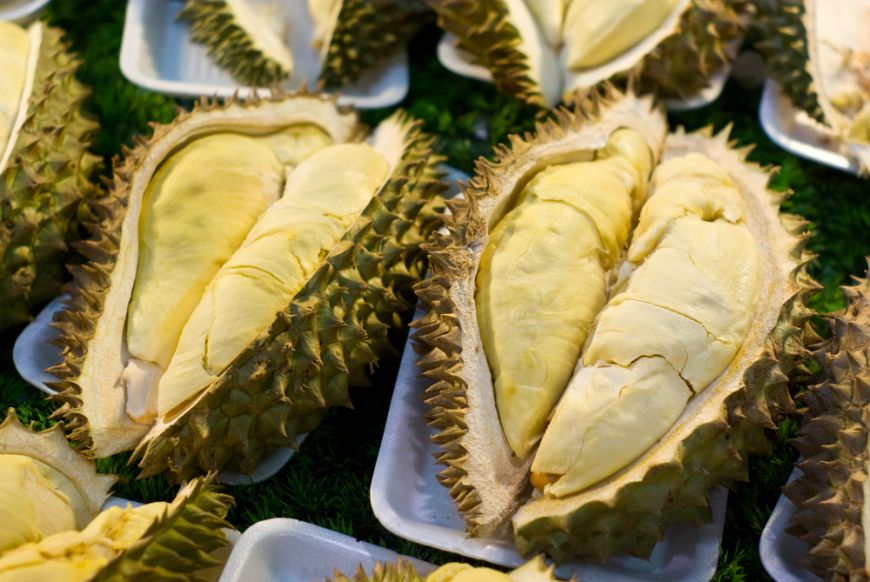

**209/365** Se pare că natura a înzestrat cu parfumuri mai puţin plăcute nu doar unele flori, ci şi cel mai dulce fruct din lume - **durian**. La fel ca şi Floarea Cadavru, durianul miroase exact ca un trup în stare de putrefacţie. Creşte în Asia de Sud şi ajunge să aibă dimensiuni impunătoare, de până la 30 de centimetri, şi cântăreşte în jur de 3kg. În unele ţări, transportarea acestui fruct în transport public este strict interzisă şi se amendează!

