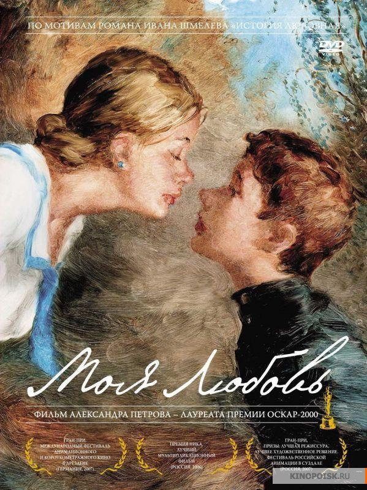

**21/365** Crearea desenului animat "Моя tлюбовь" a durat patru ani, timp în care autorul, Alexandru Petrov, a pictat pe sticlă cu ulei fiecare cadru în parte. Pensula era folosită doar pentru a desena cele mai mici detalii, în rest, Petrov folosea doar degetele sale. Pentru un singur minut de animaţie, e nevoie de peste 1.000 de imagini, astfel pentru cele 26 de minute de animaţie, au fost pictate cel puţin 26.000 de imagini. Desenul animat a luat mai multe premii, printre care a fost nonimat şi la Oscar.

Video: https://youtu.be/8_RPq5pC42w

