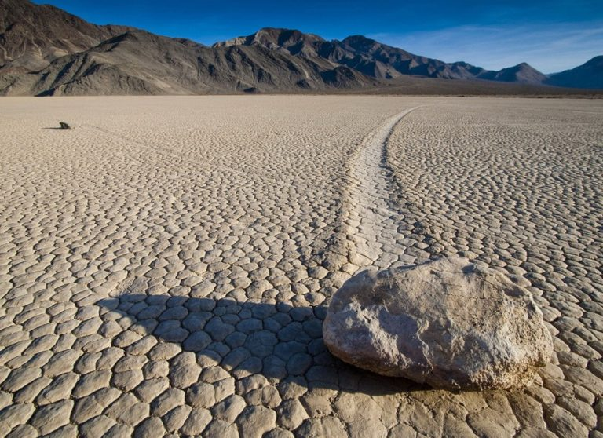

**210/365** În Valea Morţii, California, SUA, există un fenomen absolut unic. Pietre masive se deplasează fără a fi mişcate de animale sau oameni. Cercetătorii încearcă de mai mult timp să găsească o explicaţie pentru acest fenomen, însă nu au ajuns la un numitor comun. Unele pietre ajung să cântărească şi 270kg, lăsând urme lungi pe solul din valea netedă. Urmele lăsate de mişcarea pietrelor ajung să aibă o lungime de la câţiva metri până la câteva zeci de metri.
Una din primele teorii susţinea că pietrele sunt mişcate de mici tornade care se formau după ploaie.
Altă teorie susţinea că pietrele se deplasează datorită unui fenomen magnetic. Totuşi, această teorie a fost contrazisă din cauza că pietrele nu conţin elemente cu proprietăţi magnetice, precum metalele.
Cea mai plauzibilă teorie la acest moment rămâne a fi cea care presupune că acest fenomen presupune o combinaţie de vânt, temperatură şi apă. După ploaie, apa se adună la suprafaţă, iar dacă temperatura scade sub limita de îngheţ, se formează un strat subţire de gheaţă. În condiţiile de vânt puternic, pietrele pot fi mişcate pe acel strat de gheaţă şi lasă urme pe solul îmbibat cu apă. Totuşi, nimeni încă nu a reuşit să înregistreze deplasarea pietrelor, aşa că fenomenul încă rămâne un mister.

