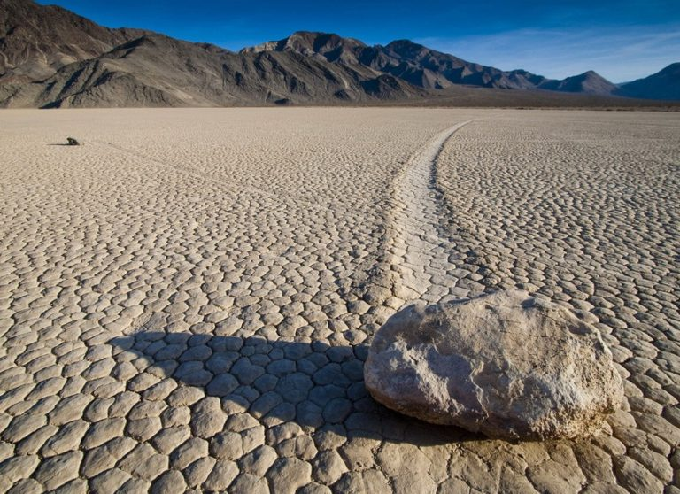

**211/365** Cele şapte minuni ale lumii antice reprezintă o expresie literară a poetului grec Antipater din Sidon, care scria despre locurile frumoase pe care le vizitase. Acesta se arăta încântat că a avut ocazia să viziteze cele mai impresionante locuri din acea perioadă. A fost ales numărul şapte, fiindcă pentru greci reprezenta întruchiparea perfecţiunii. Toate cele şapte edificii au existat simultan circa 60 de ani, astfel puţini au reuşit să le vadă pe toate. Interesant este şi faptul că cinci din cele şapte edificii erau capodopere greceşti.
În ordine cronologică, lista arată în felul următor:
1. Marea Piramidă din Gizeh (2550 î.Hr.);
2. Grădinile suspendate ale Semiramidei (600 î.Hr.);
3. Templul zeiței Artemis din Efes (550 î.Hr.);
4. Statuia lui Zeus din Olympia (435 î.Hr.);
5. Mausoleul din Halicarnas (351 î.Hr.);
6. Colosul din Rhodos (292-280 î.Hr.);
7. Farul din Alexandria (secolul al III-lea î. Hr.).

