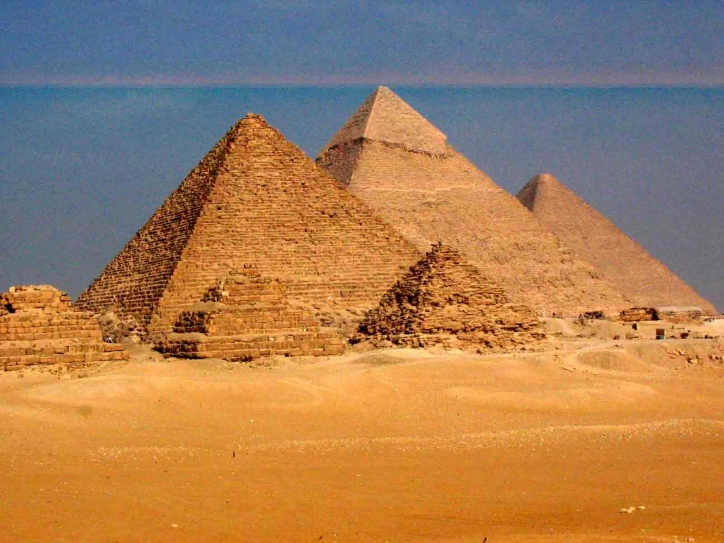

**212/365** Prima minune din lista celor şapte minuni antice, deşi e cea mai veche, e totodată unica care s-a păstrat până în prezent. Construită în jurul anilui 2560 î.e.n. pentru a servi drept mormânt, piramida e cunoscută sub numele de Piramida lui Keops sau Marea Piramidă din Giza. Până a fi construit Turnul Eifel, piramida, pe parcursul a 43 de secole a fost cea mai înaltă construcţie. Iniţial avea înălţimea de 146 m, latura de 227 m şi cuprinde circa 2.521.000 metri cubi de piatră. Potrivit lui Herodot, construcţia piramidei a durat 20 de ani şi a fost nevoie de 100.000 de oameni.
Interesant este faptul că fiecare parte a piramidei este orientată spre câte un punct cardinal - nord, sud, est şi vest.
În anul 641 e.n., când arabii au cucerit Egiptul şi au deschis piramida, în căutare de comori, sarcofagul era gol.

