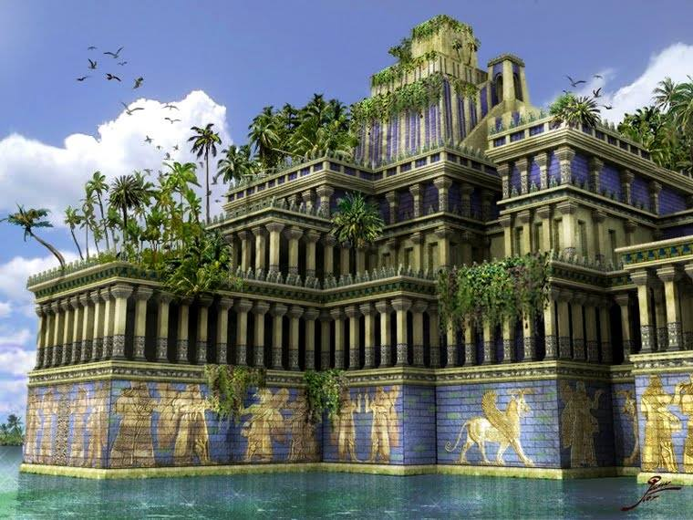

**213/365** A doua minune a lumii antice, din lista celor şapte, este singura care nu a fost încă dovedită. Numite Grădinile Suspendate din Babilon sau Grădinile Semiramidei, acestea ar fi fost construite în jurul anului 600 î.e.n., iar conform istoricului Diodor din Sicilia, uriaşele grădini ajungeau să ocupe o suprafaţă de 15000m2 şi se ridicau pe terase de până la 77m înălţime. Totodată, aceste grădini aveau un sistem ingenios de irigaţii, format din pompe cilindrice, a căror secret nu se cunoaşte. Sub terase erau construite camere răcoroase pentru familia regală. Diodor spunea despre grădini: "...Terasele erau pline de plante de toate felurile, în stare să încânte vederea prin mărimea și frumusețea lor".
Conform unor ipoteze, grădinile fie au fost dărâmate de perşi în timpul ocupării Babilonului, fie au fost distruse de un cutremur puternic.

