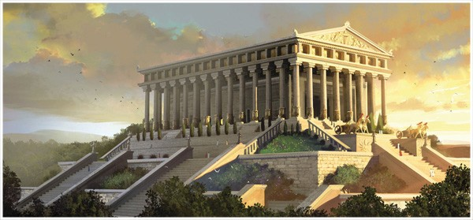

**214/365** Din ce-a de a treia minune a lumii antince, n-a mai rămas nimic în afară de câteva ruine. Templul zeiţei Artemis din Efes a fost construit în anul 550 î.e.n., iar în anul 365 î.e.n. a fost distrus într-un incendiu. În cinstea zeiţei vânătorii şi a şi a naturii sălbatice, Artemis, a fost construit un templu cu lungimea de 105m şi 51m lăţime. Statuia zeiţei avea o înălţime de doi metri şi era acoperită cu aur şi argint. Se afla în centrul templului şi era înconjurată de 127 de coloane cu o înălţime de 18m.
Filosoful grec Philon spunea despre templu următoarele: "Am văzut zidurile din Babilon, am vazut grădinile din Semiramis, am văzut statuia lui Zeus din Olimp, Colosul din Rodos, piramidele. Dar când am văzut templul din Efes, celelalte minuni au dispărut ca în ceaţă".
Construcţia unui nou templu în cinstea zeiţei Artemis a început în 323 î.e.n. şi a continuat mai mulţi ani. Acesta era mai mare, având 69m lăţime şi 137m lungime, însă numărul şi înălţimea coloanelor a rămas aceeaşi. În 268 e.n., şi acest templu a fost incendiat, iar istoria de mai departe a acestuia este neclară.
După săpăturile arheologice din secolul XIX şi XX, mai multe obiecte şi basoreliefuri au fost transportate la Londra, la British Museum.

