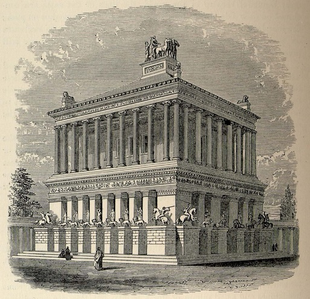

**216/365** Ruinele **Mausoleului din Halicarnas**, cea de a cincea minunie a lumii antice, astăzi se află pe teritoriul Turciei, la Bodrum. Opera arhitecţilor Pytheos şi Satyros şi a sculptorilor Scopas şi Timotheos fusese destinată guvernatorului Mausol, care a guvernat provincia elenistică Scaria între anii 377-353 î.e.n. Mausol însă nu a apucat să vadă mausoleul său terminat, iar Artemisa, soţia sa, a continuat lucrările începute. Totuşi, nici ei nu i-a fost sortit să vadă construcţia finisată, murind la doar doi ani după soţul său. Arhitecţii au finisat lucrările în anul 335 î.e.n., realizând ceea ce a devenit una din minunile lumii antice. Mausolelul avea dimensiuni impunătoare, mai ales pentru acele timpuri, echivalând cu o clădire înaltă de 16 etaje din zilele noastre. Deşi oraşul fusese cucerit de Alexandru cel Mare, monumentul fusese cruţat şi tratat cu respect. În secolul al XII-lea a fost distrus de un puternic cutremur, iar ruinele acestuia sunt expuse în cadrul unui muzeu în aer liber.

