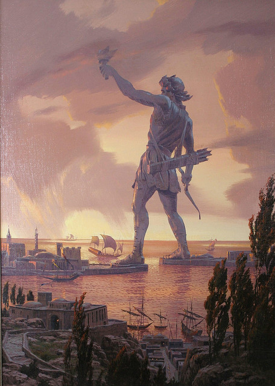

**217/365 Colosul din Rhodos**, construit în jurul anului 280 î.e.n, cea de a şasea minunine a lumii antice, a dăinuit pentru aproximativ 50 de ani, fiind distrus de un cutremur în anul 226 î.e.n. Conform surselor antice, statuia a fost construită în cinstea zeului Soare, Helios, dar şi pentru a comemora victoria împotriva unui asediu condus de liderul macedonian Demetrius Poliorcetes în 305 î.e.n. După victorie, locuitorii Rhodos-ului au vândut echipamentul rivalilor ce rămăsese după ce aceştia plecaseră şi l-au vândut, pentru a finanţa ridicarea colosului.Colosul fusese proiectat de sculptorul Chares din Lindos, avea o înălţime de 33m şi era expus pe o platformă de 15m. Statuia a fost construită din bronz şi întărită cu fier şi piatră.Pe inscripţia Colosului din Rhodos se spunea: "Pentru tine, Soare, a înălţat poporul din Rhodos această statuie din bronz ce se înalţă spre culmile Olimpului, după ce a domolit valurile razboiului şi şi-a încoronat oraşul cu prăzile luate de la duşmani. Nu numai peste mări, dar şi pe uscat poporul din Rhodos a aprins frumoasa torţă a libertăţii". În anul 226 î.e.n., după un cutremur puternic, colosul s-a prăbuşit la pământ, unde a stat până în anul 654 e.n., când arabii care au invadat insula au vândut statuia pe bucăţi, unui evreu din Siria, care au fost transportate pe spatele a 900 de cămili. Plinius cel Bătrân scria despre statuie: "Chiar şi prăbuşit la pământ, era uimitor!".

