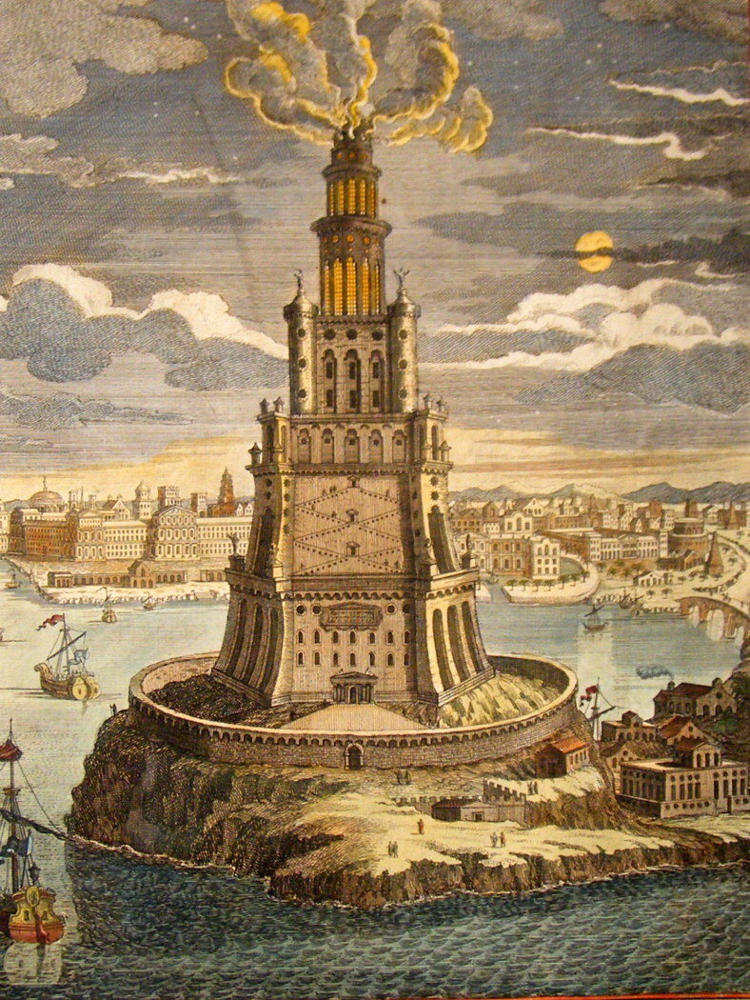

**218/365** Construit în anul 280 î.e.n., **Farul din Alexandria**, cea de a şaptea minune a lumii antice, a avut o înălţime cuprinsă între 110 şi 130 de metri, fiind cel mai înalt far construit vreodată. Timp de peste 1700 de ani, cu ajutorul oglinzilor reflectorizante pe timpul zile şi a unor focuri pe timp de noapte, farul a ghidat marinarii către oraşul-port Alexandria, iar lumina puteau fi văzută până la 50km distanţă, astfel, fiind unica minune a lumii antice cu adevărat utilă. Construcţia farului a fost legată de domnia lui Alexandru cel Mare, care a fondat oraşul Alexandria în anul 332 î.e.n. Iniţial oraşul nu era unul important, iar accesul corăbiilor spre el se făcea anevoios, iar după mai multe naufragii, a apărut necesitatea farului. Începutul construcţiilor a avut loc în 299 î.e.n., în timpul domniei lui Ptolomeu Soter, succesorul lui Alexandru cel Mare. Farul a fost ridicat pe o insula Pharos, iar lucrările de construcţie se estimează că ar fi durat 20 de ani.Ca şi alte câteva minuni a lumii antice, Farul din Alexandria a fost distrus de câteva cutremure, iar ruinele au fost folosite la construcţia unei fortăreţe.

