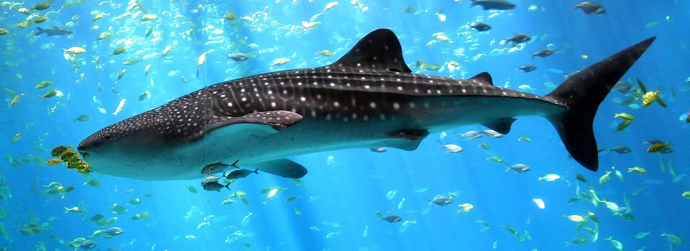

**22/365** Deşi poartă numele a două mamifere, totuşi este cel mai mare peşte care există în prezent. **Rechinul balenă** poate atinge lungimea de 15m, iar cel mai mare exemplar confirmat cântărea 21 de tone. Deşi este un peşte enorm, acesta este inofensiv pentru om, hrănindu-se cu peşte, plancton şi moluşte. Se întâlneşte în apele calde ale oceanului planetar, de obicei în grupuri mici sau în singurătate.

