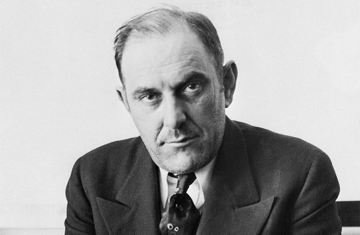

**220/365** Aţi încercat vreodată să vindeţi Turnul Eifel? Credeţi că e o aberaţie? Ei bine, **Victor Lustig** a fost de altă părere. Unul din cei mai cunoscuţi infractori ai secolului XX a reuşit să vândă Turnul Eifel fără a avea niciun drept asupra lui. Dacă acest fapt v-a uimit, să ştiţi că Victor a reuşit să vândă Turnul Eifel de două ori!În 1925, în ziarele franceze apare informaţia că Turnul Eifel necesită reparaţie. Victor Lustig falsifică un act oficial, precum că ar avea un post important în unul din ministere, şi trimite scrisori câtorva companii în care îi informează despre necesitatea serviciilor acestora. Le dă întâlnire şefilor acestor companii în localuri scumpe, unde le explică că Turnul Eifel a fost construit pentru una din expoziţii care a avut loc cu 30 de ani în urmă (fapt adevărat) , şi acesta deja nu mai folosea la nimic, dar i-a rugat să nu spună nimănui despre acest fapt, pentru că unii orăşeni deja s-au îndrăgostit de turn şi să nu-i întristeze. Peste câteva zile, dreptul pentru dărâmarea turnului i-au fost vândute lui Andre Poisson, care credea că această afacere avea să-l avantajeze şi să-şi crească reputaţia. Victor Lustig, împreună cu partenerul său de "afaceri" au fugit în Australia cu tot cu bani.Peste câţiva ani, Victor s-a întors din nou în Franţa şi a vândut Turnul Eifel altei persoane, însă acesta şi-a dat seama de fraudă şi a anunţat poliţia. Victor Lustig reuşise să fugă în SUA, dar acolo fusese prins de poliţia americană şi băgat la închisoarea Alkatraz pentru mai multe capete de acuzare pentru o perioadă de 15 ani. Peste 12 ani de detenţie, Victor Lustig a murit în închisoare din cauza pneumoniei.

