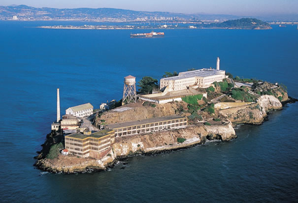

**221/365** Una din cele mai vestite închisori din lume la sigur este **Alcatraz**, supranumită de deţinuţi "Hellcatraz" (Iadul Catraz). Aceasta se află pe insula cu acelaşi nume, care este situată în golful San Francisco, şi are o lungime de 511m şi o lăţime de 180m. În 1854, încep lucrările de construcţie a fortului, însă din cauza factorilor geografici şi meteorologici, acestea derulau în condiţii dificile. Pentru a debarca pe insulă, exista un singur loc, iar din cauza curenţilor puternici, a ploii şi a ceţii, accesul era îngreunat. Primii deţinuţi au fost trimişi pe insulă în anii 1870, atunci când autorităţile au hotărât că Alcatraz e mai potrivit pentru detenţie decât pentru apărare. Deţinuţii erau ţinuţi în condiţii cumplite, astfel că mulţi şi-au găsit sfârşitul în închisoare.
Închisoarea a fost modernizată şi extinsă constant, pentru a putea face faţă numărului mare de deţinuţi. În 1933 Alcatraz a încetat să funcţioneze ca închisoare militară, când a trecut în administrarea Birolui Federal al Penitencialelor. În 1934 după ce a fost modernizată, a devenit închisoare federală. Datorită amplasării insulei şi a normelor de siguranţă, Alcatraz a devenit cea mai sigură închisoare din SUA. Odată cu trecerea timpului, închisorea devenea mai vestită, "cazând" cei mai înrăiţi infractori. Penitenciarul era împărţi în patru corpuri A, B, C şi D, iar celulele aveau doar 2.7m lungime şi 1.5m lăţime, mobilate sumar. Directorii închisorii erau cunoscuţi pentru severitate, astfel, de exemplu, vestitul Al Capone a fost tratat la fel ca şi ceilalţi deţinuţi, fiind impus la munci murdare, iar după ce îşi pierduse influenţa, a devenit nepopular şi chiar a fost atacat de un coleg, cu o pereche de foarcece. Acesta a părăsit închisoarea slăbit şi bolnav, decedând la doar 48 de ani.
De-a lungul timpului, au avut loc câteva tentative de evadare. Din acei deţinuţi care şi-au încercat "norocul", 6 au fost împuşcaţi, 23 au fost reţinuţi, doi s-au înecat, iar 5 sunt daţi dispăruţi, astfel că oficial nicio evadare nu a avut succes.
În 1969, închisoare a fost desfiinţată, iar în momentul de faţă este proprietatea Zonei Naţionale de Agrement "Poarta de Aur".  Anual, închisoarea atrage zeci de mii de vizitatori, fascinaţi de istoria brutală a Alcatrazului.

