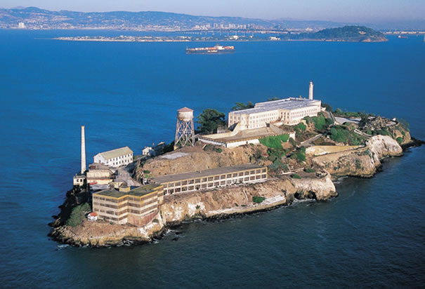

**222/365** La 10 august 1793, pentru publicul larg au fost deschise uşile muzeului **Luvru**, unul din cele mai importante şi bogate muzee din lume, şi totodată unul din cele mai vizitate locuri din lume. Construcţia acestuia a început la mijlocul secolului al XVI-lea, iar în timpul Impreiului Napolenian, purta numele de Muzeul Napoleon. Acesta găzduieşte peste 380.000 de obiecte din perioada preistorică până în epoca modernă,
iar la deschiderea oficială a muzelui, au fost expuse 537 de tablouri, majoritatea din ele provenind din colecţia regală sau a bisericilor.
Muzeul a fost mărit treptat, pe parcursul timpului, iar în perioada lui Napoleon al III-lea, au fost achiziţionate peste 20.000 de piese. Printre cele mai celebre piese care sunt expuse la muzeu, sunt "Mona Lisa" de Leonardo da Vinci, "Libertatea conducând poporul"" de Eugene Delacroix, Codul lui Hamurabi ş.a.
La 30 martie 1989 a fost inaugurată Piramida de sticlă în mijlocul Curţii Napoleon, şi iniţial a fost subiectul unor critici, pe motiv că ar distruge integritatea clădirilor istorice.

