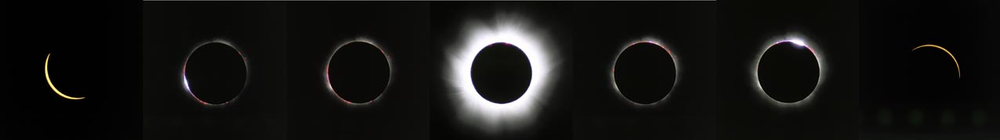

**223/365 Eclipsa de Soare** se produce atunci când Luna trece între Pământ şi Soare. Datorită faptului că văzut de pe Pământ, discul Lunii este mai mare decât al Soarelui, astfel, în momentul când satelitul natural al Pământului se află între Pământ şi Soare, blochează lumina provenită de la corpul ceresc pentru câteva minute. Eclipsa de Soare poate fi văzută doar dintr-o anumită zonă de pe glob.
Eclipsa totală are loc atunci când soarele este acoperit complet de Lună.
Eclipsa inelară apare atunci când Soarele şi Luna sunt aliniate exact cu Pământul, iar diametrul Lunii e mai mic decât al Soarelui, astfel, se vede marginea în formă de inel.
Eclipsa parţială apare atunci când Soarele şi Luna nu sunt aliniate exact, astfel că Luna obturează Soarele doar parţial.
Eclipsa de Soare de la 11 august 1999 a fost ultima eclipsă totală din secolul al XX-lea. Fenomenul putea fi văzut cel mai bine din România, şi a avut loc la ora 14:07. Timp de 2 minute şi 23 de secunde a fost întuneric total. În acelaşi an, Banca Națională a României a emis o monedă de circulație, cu valoarea nominală de 500 de lei, pentru comemorarea evenimentului astronomic al anului, Eclipsa totală de Soare din 1999 şi o bancnotă cu valoarea nominală de 2.000 de lei, totodată aceasta fiind prima bancnotă din polimeri emisă în Europa.

