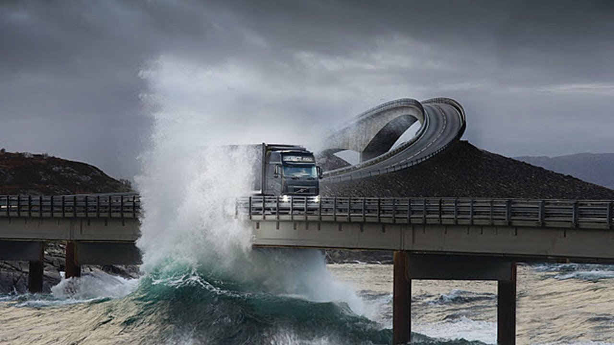

**224/365 Drumul Atlanticului** este o şosea cu o lungime de 8.3km şi uneşte oraşele Kristiansund şi Molde din Norvegia. Podurile joase par a ieşi din mare, iar furtunile care se abat asupra zonei, oferă privelişti spectaculoase. Şoseaua a fost desemnată Construcţia Secolului în Norvegia în 2005 şi a primit statutul de traseu turistic naţional, datorită podurilor şi a frumuseţii zonei. Şapte poduri unesc insulele prin care trece impresionanta şosea, iar cel mai înalt este Storseisundet. În timpul construcţiei, muncitorii au înfruntat circa 12 uragane şi au deschis şoseaua în 1989.

