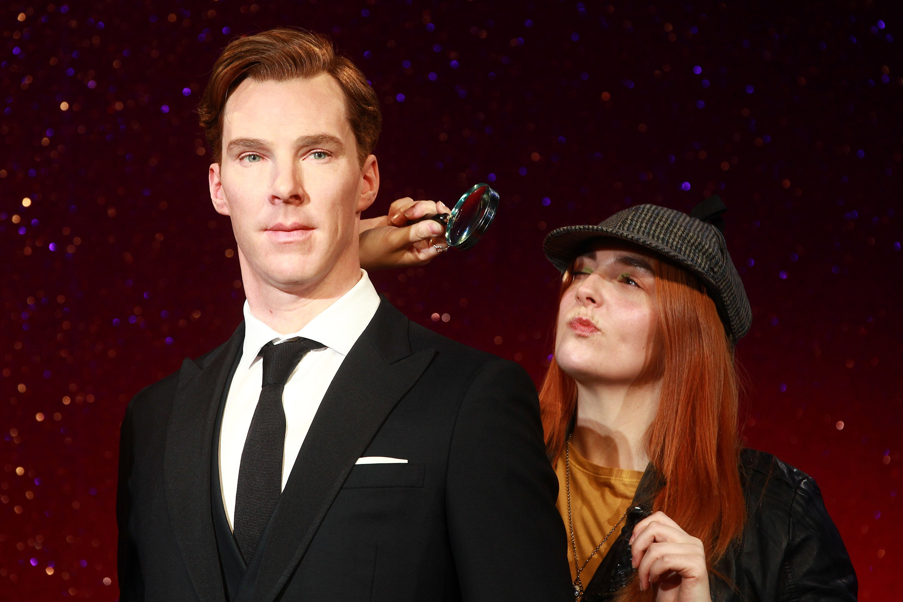

**226/365** În 1761, la Strassbourg, Franţa, se naşte Marie Grosholtz, care avea să devină mai târziu cunoscută în toată lumea ca **Madame Tussaud**. De la o vârstă fragedă, Marie a devenit eleva lui Philippe Curtius, medic şi mare modelist în ceară, care devenise foarte cunoscut printre parizieni. El a învăţat-o arta sculptării şi a modelării în ceară, antrenând-o în realizarea figurilor aparţinând unor personalităţi istorice.
În 1770, doctorul Curtius a deschis la Paris o expoziţie cu personaje din ceară, realizate în mărime naturală, care a devenit foarte populară, fiind vizitată şi de oameni de la curtea regală. Datorită calităţilor sale, în 1772, Marie Grosholtz a fost numită profesoară de desen pentru sora lui Ludovic al XVI-lea, locuind nouă ani la Palatul Versailles.
În timpul Revolţuţiei Franceze, Marie a realizat câteva măşti mortuare după capetele giliotinate, printre care şi cel al lui Ludovic al XVI-lea şi a Mariei Antoaneta.
În 1794 doctorul Curtius şi-a dat suflarea, lăsând-o pe Marie, unica moştenitoare, să continue organizarea expoziţiei. În 1795 Marie s-a căsătorit cu inginerul Francois Tussaud, cu care a avut trei copii. Mai târziu, datorită timpurilor dificile din Franţa, Madame Tussaud, împreună cu fiul său mai mare, pleacă la Londra, luând cu ea şi 30 de figuri de ceară, cu care a colindat oraşele Marii Britanii timp de 33 de ani, având în permanenţă grijă să-şi completeze expoziţia cu noi figuri şi să-şi facă reclamă prin presă. În 1835, la vârsta de 74 de ani, Madame Tussaud s-a decis să deschidă o expoziţie permanentă la Londra, la "The Bazar", o clădire situată pe Baker Street, domiciliul faimosului detectiv Sherlock Holmes. La vârsta de 81 de ani, Madame Tussaud a creat ultima sa lucrare, un autoportret, exponat ce îşi întâmpină şi astăzi vizitatorii la intrarea în expoziţie. A murit la vârsta de 89 de ani, lăsând moştenire expoziţia celor doi fii, Joseph şi Francis.
Când Joseph a murit, fiu lui Francis, Jospeh Randall Tussaud, a devenit singurul proprietar al expoziţiei, iar din 1884 a mutat expoziţia într-un local nou, situat în Marylebone Road, unde se află şi astăzi, într-o zonă aglomerată, fapt care a dus la creşterea numărului de vizitatori.
În noaptea de 18 martie 1925, din cauza unui scurt circuit, un incendiu a distrus expoziţia în totalitate, rămânând întregi doar zidurile exterioare şi magazia de matriţe de la subsol. Muzeul a fost redeschis abia după trei ani, adăpostind în aceeaşi clădire o sală de cinema şi un restaurant luxos, iar expoziţia oferea vizitatorilor figurine noi, create după matriţele rămase intacte. În prima zi de la redeschidere, muzeul a fost vizitat de 24.000 de oameni!
Muzeul are mai multe săli, fiecare având o tematică sau prezentând o perioadă istorică. Printre personalităţile sculptate în ceară, putem admira figurine precum cea a reginei Elizabeta a II-a, Copernic, Galilei, Newton, Einstein. Pe lângă personalităţile istorice, în muzeu pot fi văzute şi personalităţi precum Angelina Jolie, Benedict Cumberbatch, will.i.am, Justin Bieber şi alţii.

