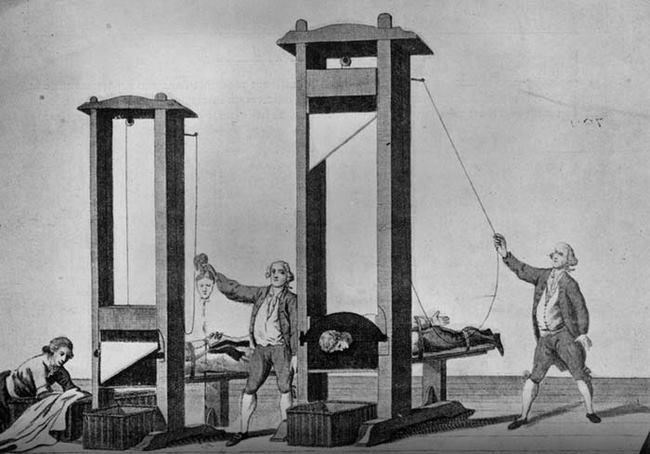

**23/365** Dacă credeţi că **ghilotina** e un fenomen istoric de sute de ani descris doar în cărţi, atunci vă înşelaţi. Ultima executare prin decapitare în Europa a avut loc în 1977, la Marsilia. Hamida Djandoubi, din Tunisia a fost acuzat pentru omor, viol, tortură şi alte crime grave. Valéry Giscard d’Éstaing, preşedintele Franţei din acea perioadă a refuzat apelul de a anula pedeapsa cu moartea, astfel la 4:40 dimineaţa, la 10 septembrie, Hamida a fost decapitat.

